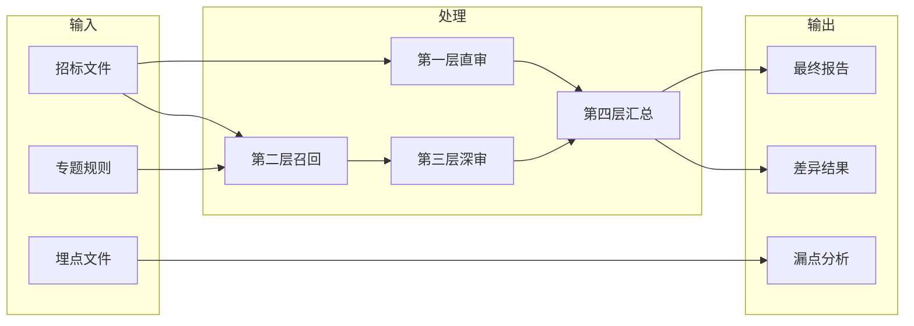
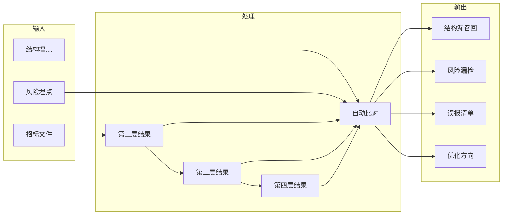

# V2 风险召回与分层深审系统方案

## 1. 目标与设计原则

### 1.1 总目标

本方案的唯一核心目标是：

- 尽量精准找到招标文件中的所有风险点

这里的“精准找到”包含两层含义：

- 不漏掉本应识别出的风险点
- 尽量减少无依据、越界或不必要的误报

当前阶段不把工程治理、运行成本、时延展示作为第一优先级，而是优先建设：

- 风险点总覆盖率
- 关键高风险问题的命中率
- 对分散条款、混合章节、细节风险的召回能力
- 基于埋点文件的持续回归验证能力

### 1.2 设计原则

1. 召回优先
   先尽量减少漏检，再通过后续层做去重、冲突识别和人工复核整理。

2. 分层负责
   每一层只解决自己最擅长的问题，不要求单层独立完成“找全所有风险点”。

3. 层间补漏
   后一层不是简单重复前一层，而是显式补前一层的漏。

4. 证据优先
   后续判断必须尽量建立在可定位、可复核的正文证据上，而不是凭空总结。

5. 回归驱动
   系统优化必须围绕“招标文件 + 埋点文件”的固定样本集开展，避免凭感觉调 prompt。

### 1.3 四层总体分工

四层职责定义如下：

- 第一层：全文直审，建立全局基础风险盘
- 第二层：结构增强与证据召回，尽量找全相关正文位置
- 第三层：专题深审，围绕风险类型做更细判断
- 第四层：对比汇总，做去重、补漏、冲突整理并生成最终结果

## 2. 第一层详细设计

### 2.1 目标定位

第一层负责：

- 从全文视角先抓一版基础风险
- 给系统提供全局兜底能力
- 为后续专题层提供比较基线

第一层不是“找全所有风险点”的唯一承担者，但它不可替代，因为它具有：

- 全文上下文视角
- 明显风险的快速命中能力
- 与后续专题结果做 compare 的基础作用

### 2.2 输入与输出

输入：

- 招标文件全文正文

输出：

- `baseline_review.md`
- `baseline_risks`
- `baseline_summary`

### 2.3 适合发现的问题

第一层更适合识别：

- 明显限制竞争条款
- 明显评分办法不量化问题
- 明显品牌型号倾向
- 明显商务条款失衡
- 明显“最终解释权归采购人”类程序问题
- 文档层面前后矛盾或整体风格异常的问题

### 2.4 设计逻辑

第一层的工作逻辑是：

1. 全文输入
2. 使用稳定主 prompt 做一次基础全文审查
3. 输出统一格式风险报告
4. 将结果作为后续 compare 的一条独立来源

### 2.5 能力边界

第一层不应过度承担以下问题：

- 标准编号/名称细节一致性
- 标准是否废止、滞后或冲突
- 藏在表格或混合章节中的局部细节风险
- 分散在付款、验收、商务要求中的跨章节联动问题
- 专题边界很强的专业问题

这些问题主要由第二层和第三层补强。

### 2.6 第一层在整体系统中的价值

第一层的主要价值不是“最细”，而是：

- 提供全文兜底
- 提供全局风险基线
- 帮助第四层识别 baseline-only 风险
- 帮助判断哪些问题是专题补出的新增风险

## 3. 第二层详细设计

### 3.1 目标定位

第二层解决的核心问题不是“风险判断”，而是：

- 和某一类风险有关的正文，能不能尽量找全

第二层是整个系统中最关键的召回层。第三层专题能力再强，如果第二层证据召回不完整，最终仍会漏风险点。

### 3.2 第二层的职责

第二层负责：

- 弱结构切分
- 模块概率识别
- 专题证据召回
- 混合章节补召回
- 缺口提示输出

### 3.3 输入与输出

输入：

- 全文正文
- 专题注册表
- 主题边界和规则配置

输出：

- `SectionCandidate[]`
- `ModuleHit[]`
- `document_map.json`
- `EvidenceBundle[]`
- `TopicCoverage[]`
- `evidence_map.json`

### 3.4 子流程设计

#### 3.4.1 弱结构切分

切分目标不是建立完美目录树，而是形成可用于召回的候选正文块。

切分线索包括：

- 标题行
- 编号层级
- 表格块
- 列表块
- 关键词密集段
- 连续段落的主题变化

输出结构建议：

- `section_id`
- `title`
- `text`
- `line_range`
- `page_hint`
- `heading_level`
- `table_flag`
- `list_flag`

#### 3.4.2 模块概率识别

每个 section 不应只给一个死标签，而应输出：

- `primary_module`
- `secondary_modules`
- `confidence`
- `reason`

候选模块建议至少包括：

- `qualification`
- `scoring`
- `contract`
- `acceptance`
- `technical`
- `procedure`
- `policy`

规则设计建议：

- 先由规则做粗分类
- 低置信时允许触发一次 LLM 复判
- 保留多模块可能性，避免混合章节被过早裁断

#### 3.4.3 专题证据召回

围绕每个专题，从多个 section 中召回相关证据，而不是只选单一章节。

例如 `contract_payment` 专题，应允许同时召回：

- 付款节点
- 验收触发条件
- 商务要求中的结算条款
- 违约责任
- 保证金与质保条款

输出建议：

- `bundle_id`
- `topic`
- `sections`
- `recall_reason`
- `missing_hints`

#### 3.4.4 混合章节补召回

第二层必须专门处理混合章节问题。

常见混合章节包括：

- 资格 + 评分
- 商务 + 验收
- 技术参数 + 验收标准
- 样品演示 + 评分

处理原则：

- 允许一个 section 同时进入多个 EvidenceBundle
- 主归属只用于排序，不用于排他
- 混合章节优先保证召回完整，再由第三层做专题裁决

### 3.5 第二层的关键成功标准

第二层最重要的成功标准不是“切分漂亮”，而是：

- 关键专题的证据覆盖足够完整
- 付款/验收/商务等跨章节问题不被漏召回
- 技术标准与技术倾向性问题能被分流到合适专题
- 样品/演示等特殊条款不会只落在评分章节而被漏掉

### 3.6 第二层在整体系统中的价值

第二层是“找全风险点”的核心基础层。

如果第二层召回不全：

- 第三层专题深审会漏看证据
- 第四层汇总无法补出本来就没进入系统视野的风险

## 4. 第三层详细设计

### 4.1 目标定位

第三层解决的问题是：

- 在已经召回的相关证据上，对某一类风险做更深、更细、更稳定的判断

第三层不是全文阅读，而是“基于专题证据包的定向深审”。

### 4.2 专题层的基本职责

第三层负责：

- 专题边界约束
- 专题证据审查
- 风险定性
- 人工复核判断
- 专题级结构化输出

### 4.3 推荐专题体系

建议专题至少包括：

1. `qualification`
2. `performance_staff`
3. `scoring`
4. `samples_demo`
5. `technical_bias`
6. `technical_standard`
7. `contract_payment`
8. `acceptance`
9. `procedure`
10. `policy`

### 4.4 专题设计逻辑

每个专题必须定义：

- `topic_key`
- `topic_label`
- `prompt`
- `boundary`
- `priority`
- `input_modules`
- `must_review_items`
- `out_of_scope`

### 4.5 专题边界设计原则

#### 4.5.1 边界必须清楚

例如：

- `technical_bias` 只处理品牌、型号、原厂、兼容性、专利专有技术倾向
- `technical_standard` 只处理标准名称、编号、有效性、检测认证
- `contract_payment` 只处理付款、履约、保证金、违约责任
- `acceptance` 只处理验收主体、流程、标准、试运行

#### 4.5.2 专题允许三种结果

每个专题都应允许：

- 明确风险
- 未发现
- 需人工复核

#### 4.5.3 专题必须保留证据出处

输出不能只给结论，必须包含：

- 原文位置
- 原文摘录
- 风险判断
- 法律/政策依据
- 整改建议

### 4.6 专题输出结构

建议每个专题输出：

- `topic`
- `summary`
- `risk_points`
- `need_manual_review`
- `coverage_note`
- `missing_evidence`
- `selected_sections`
- `raw_output`

### 4.7 第三层重点补的风险类型

第三层重点补第一层不稳定的问题，包括但不限于：

- 评分标准不量化
- 样品演示答辩要求过重
- 标准名称与编号不一致
- 标准疑似废止或错引
- 品牌型号隐性倾向
- 检测认证要求歧义或过严
- 付款与验收联动失衡
- 验收主体和验收裁量权问题
- 证书奖项人员要求与履约不直接相关

### 4.8 第三层在整体系统中的价值

第三层是“风险判断精度”的核心层。

它的主要作用是：

- 补第一层的细节漏检
- 提高具体风险类型的识别深度
- 让系统从“粗审”提升到“专题深审”

## 5. 第四层详细设计

### 5.1 目标定位

第四层解决的问题是：

- 如何把第一层和第三层产生的多个结果合并成一份可读、可复核、尽量不漏的最终报告

第四层不是简单拼接器，而是：

- 去重器
- 差异分析器
- 人工复核整理器

### 5.2 第四层职责

第四层负责：

- 风险聚类
- 来源标记
- 冲突识别
- baseline-only / topic-only 分析
- 人工复核原因整理
- 最终 Markdown 统一输出

### 5.3 输入与输出

输入：

- 第一层 baseline 风险
- 第三层 topic 风险

输出：

- `comparison.json`
- `coverage_summary`
- `manual_review_items`
- `final_review.md`

### 5.4 核心处理逻辑

#### 5.4.1 风险聚类

对可能属于同一问题的结果进行聚类，聚类线索包括：

- 标题关键词
- 审查类型
- 原文位置接近度
- 原文摘录相似度
- 专题来源关系

#### 5.4.2 来源标记

每个最终风险点都应保留：

- 是否来自 baseline
- 来自哪些专题
- 是否多来源共同命中

#### 5.4.3 冲突识别

当出现以下情况时，必须保留冲突信息：

- 风险等级不一致
- 审查类型归属不一致
- 是否需人工复核判断不一致

#### 5.4.4 覆盖分析

第四层必须明确区分：

- `baseline_only`
- `topic_only`
- `merged`
- `conflict`
- `manual_review`

这能帮助分析：

- 第一层发现了什么
- 第三层补出了什么
- 哪些问题是系统内部结论不一致的

#### 5.4.5 最终报告装配

最终报告应优先使用：

- 聚类后的最终风险点
- 保留来源标签
- 保留人工复核理由
- 保留必要的冲突提示

### 5.5 第四层在整体系统中的价值

第四层的价值不在于“让页面更好看”，而在于：

- 把多层能力真正收敛成一份报告
- 保留补漏证据
- 保留冲突信息
- 帮助人工复核人员快速定位重点

## 6. 基于埋点文件的回归方案

### 6.1 回归方案目标

埋点文件的用途不是参与主流程判断，而是作为“近似金标准”对系统进行分层回归验证。

目标包括：

- 验证第二层是否召回到关键证据
- 验证第三层是否命中关键风险
- 验证第四层是否正确合并与补漏
- 识别系统当前的漏点、误报点和冲突点

### 6.2 埋点文件的两类作用

#### 6.2.1 结构层埋点

用于描述：

- 哪些位置属于资格条件
- 哪些位置属于评分办法
- 哪些位置属于合同、付款、验收
- 哪些章节是混合章节
- 某一专题必须召回哪些正文位置

这部分用于第二层回归。

#### 6.2.2 风险层埋点

用于描述：

- 实际风险点标题
- 风险类别
- 风险等级
- 原文位置
- 是否应人工复核

这部分用于第三层和第四层回归。

### 6.3 分层回归逻辑

### 6.4 第二层回归重点

重点验证：

- 资格条件识别准确性
- 评分办法识别准确性
- 合同/付款/验收识别准确性
- 混合章节漏召回情况

核心问题不是“切分是否漂亮”，而是：

- 专题证据是否找全
- 是否只抓到了主章节而漏掉补充条款

### 6.5 第三层回归重点

每类专题都应覆盖四类样本：

- 明确命中样本
- 易混淆样本
- 应判“未发现”的负样本
- 需人工复核样本

这四类样本分别验证：

- 基础命中能力
- 边界判断能力
- 误报控制能力
- 审慎判断能力

### 6.6 第四层回归重点

重点验证：

- 重复问题是否成功合并
- baseline-only / topic-only 是否标记准确
- 风险等级冲突是否被保留
- 人工复核原因是否完整保留

### 6.7 回归产物建议

建议每次评估产出：

- `eval_structure.json`
- `eval_topics.json`
- `eval_compare.json`
- `missed_risks.json`
- `false_positive_risks.json`
- `manual_review_gaps.json`

### 6.8 回归结果的使用方式

回归结果不只是看分数，而是要直接转成优化任务：

- 第二层漏召回 -> 优化 EvidenceBundle 规则或模块识别
- 第三层漏判 -> 调整专题 prompt 或专题边界
- 第四层合并错误 -> 调整 compare 规则

## 7. 分阶段实施路线

### 7.1 Phase 1：召回优先

目标：

- 把第二层先做成“尽量不漏证据”的召回层

重点工作：

- 补结构层样本
- 强化混合章节召回
- 补 TopicCoverage
- 用埋点文件验证漏召回情况

阶段验收：

- 资格、评分、合同/付款/验收三类重点模块的证据召回能力稳定
- 混合章节漏召回显著减少

### 7.2 Phase 2：专题精度优先

目标：

- 把第三层做成稳定的专题判断层

重点工作：

- 完整专题 taxonomy
- 四类专题样本补齐
- 专题边界契约固化
- 负样本与人工复核样本回归

阶段验收：

- 主要专题具备稳定命中能力
- 专题误报明显下降
- 易混淆问题的主归属更稳定

### 7.3 Phase 3：汇总收口

目标：

- 把第四层做成真正的对比汇总层

重点工作：

- 聚类去重规则优化
- baseline-only / topic-only 差异分析
- 冲突与人工复核原因整理
- 最终报告结构稳定化

阶段验收：

- 最终报告去重效果稳定
- 来源标签、冲突标记、人工复核原因完整
- 可以清楚看出专题层相对 baseline 的补漏贡献

### 7.4 Phase 4：回归闭环

目标：

- 用埋点文件建立长期可持续的优化闭环

重点工作：

- 固定回归样本集
- 固定评估脚本
- 分层指标输出
- 漏点清单自动生成

阶段验收：

- 每次改动都能自动知道：
  - 命中了什么
  - 漏了什么
  - 多报了什么
  - 哪一层出了问题

## 8. 结论

这套 V2 的成熟方向，不应再定义为“多层能跑”，而应定义为：

- 第一层提供全文兜底和全局基线
- 第二层提供高召回证据池
- 第三层按专题做深审判断
- 第四层完成去重、补漏、冲突整理和统一报告
- 埋点文件驱动分层回归，持续提升风险点总覆盖率

最终目标不是让某一层“独自变强”，而是让四层形成联动：

- 第一层不遗漏明显问题
- 第二层不漏关键证据
- 第三层不漏专题细节
- 第四层不丢多层结果中的新增风险与冲突信息

只有这四层都围绕“总覆盖率”协同工作，系统才可能真正逼近“精准找到所有风险点”的目标。
