# 招标文件审查处理流程与识别架构

## 1. 文档目的

本文档用于统一说明：

1. 系统收到一份招标文件后，整体如何处理
2. 系统如何尽量准确识别出文件中的风险点
3. 各层之间的关系、输入输出物、职责边界是什么
4. 当出现误报、漏报、展示不一致时，运营、运维、研发应如何定位问题

本文档适用于：

- 领导汇报
- 运营培训
- 运维排障
- 研发对齐
- 后续规则治理与回归验收

---

## 2. 总体目标

系统处理一份招标文件，不只是生成一份报告，而是完成一条完整闭环：

1. 接收文件
2. 提取正文
3. 多层识别风险
4. 汇总、去重、分层输出
5. 在 Web 展示结果
6. 接收客户反馈
7. 将误报、漏报转为治理任务
8. 修规则、补样本、补测试
9. 回归验证并固化进基线

最终目标不是“这次跑出来”，而是：

`每发现一个问题，系统下次更准。`

---

## 3. 总体架构图

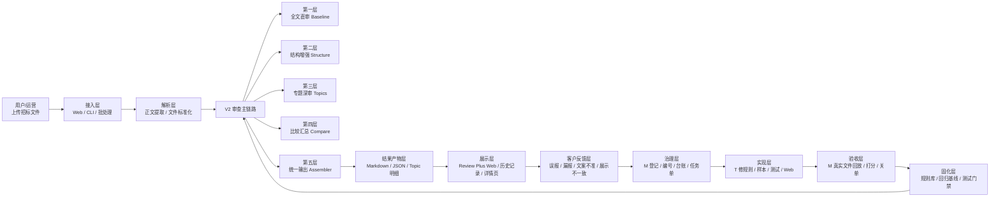

---

## 4. 主流程总览

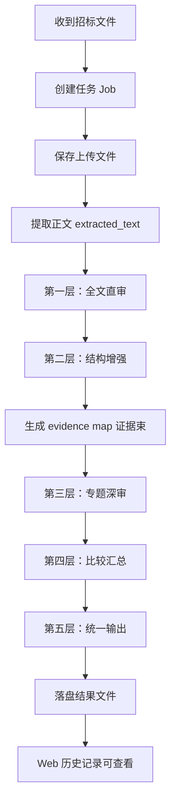

主链路可以概括为：

`文件进入 -> 文本提取 -> 三层识别 -> 比较汇总 -> 统一输出 -> Web 展示`

---

## 5. 五层处理架构

### 5.1 第一层：全文直审

目标：

- 先尽量找全可疑风险点
- 优先识别通用型、显性型风险
- 为后续专题深审提供候选风险视角

输入：

- 原始文件
- 提取后的全文文本

处理特点：

- 从全文直接审查
- 不依赖复杂结构切分
- 优先抓明显敏感表达

典型识别对象：

- 指定品牌、商标、供应商
- 将付款方式作为评分因素
- 将验收方案作为评分因素
- 要求赠品、回扣或与采购无关的服务
- 将验收检测费用转嫁给投标人
- 非进口项目引用国外标准
- 强制性标准未按规则标注星号
- 特定资质证书、认证作为不合理高分项

输出产物：

- `baseline_review.md`
- `review_raw/baseline_raw.md`

架构图：

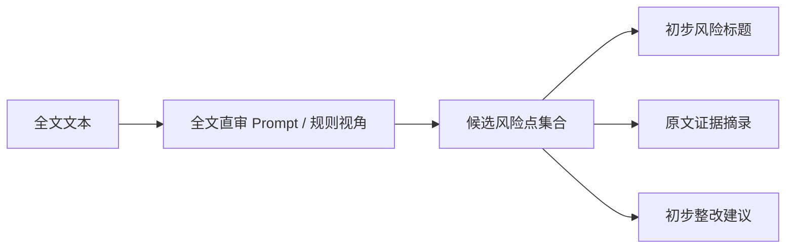

说明：

- 这一层强在“找全”
- 弱项是语境不够准、容易重复报、容易把模板或说明性文字误判为正式风险
- 因此它不是最终裁定层，而是第一道大筛网

### 5.2 第二层：结构增强

目标：

- 识别文本所在章节、模块和上下文语境
- 解决“同一句话在不同章节含义不同”的问题
- 为专题深审提供结构化证据

输入：

- 全文文本

处理内容：

- 章节切分
- 标题识别
- 模块归类
- 段落与章节映射
- 证据束构建

典型结构对象：

- 招标公告
- 资格条件
- 采购需求
- 技术要求
- 评分办法
- 商务条款
- 合同条款及格式
- 政策条款

输出产物：

- `document_map.json`
- `evidence_map.json`

架构图：

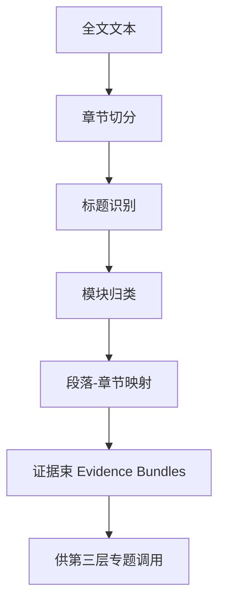

这一层为什么关键：

- “付款”写在合同模板中，和写在评分细则中，风险性质完全不同
- “留空”写在合同格式模板里，可能是正常占位；写在正式商务条款里，才可能是风险
- “国外标准”写在技术要求中，和写在背景说明中，风险强度不同

第二层本质上是在解决“找准语境”的问题。

### 5.3 第三层：专题深审

目标：

- 按业务专题分别精审
- 将不同类型的风险交给不同规则视角处理
- 解决“同一个片段是否构成正式风险”的业务判断问题

输入：

- `evidence_map.json` 中的证据束
- 专题配置
- 审查模式

常见专题：

- `qualification` 资格条件
- `performance_staff` 业绩与人员
- `scoring` 评分办法
- `technical_bias` 技术倾向性
- `technical_standard` 技术标准与检测
- `contract_payment` 付款与履约
- `acceptance` 验收条款
- `procedure` 程序条款
- `policy` 政策条款
- `technical` 技术细节
- `contract` 合同履约

输出产物：

- `topic_reviews/*.json`
- `review_raw/*_raw.md`

架构图：

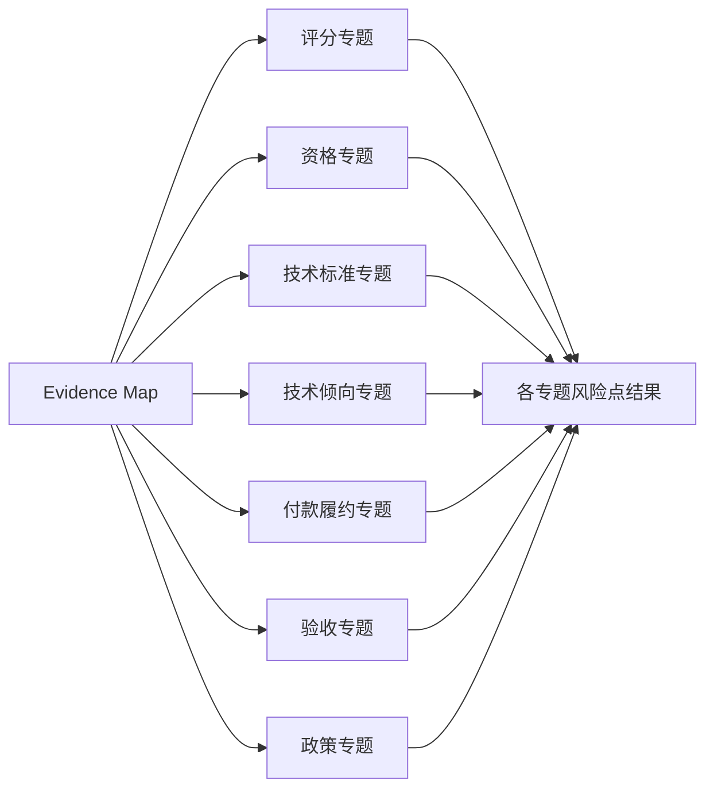

每个专题通常输出：

- 专题摘要
- 风险点列表
- 原文位置
- 风险判断
- 法规或规则依据
- 整改建议
- 是否需人工复核

这一层是业务判断最核心的一层。

### 5.4 第四层：比较汇总

目标：

- 合并第一层和第三层结果
- 对同源风险去重、归并
- 决定主风险、辅风险、待补证和排除项

输入：

- 第一层全文直审结果
- 第三层专题深审结果

处理内容：

- 同源风险合并
- 重复输出去重
- 主风险与辅风险识别
- 正式风险 / 待补证 / 排除分层

输出产物：

- `comparison.json`

架构图：

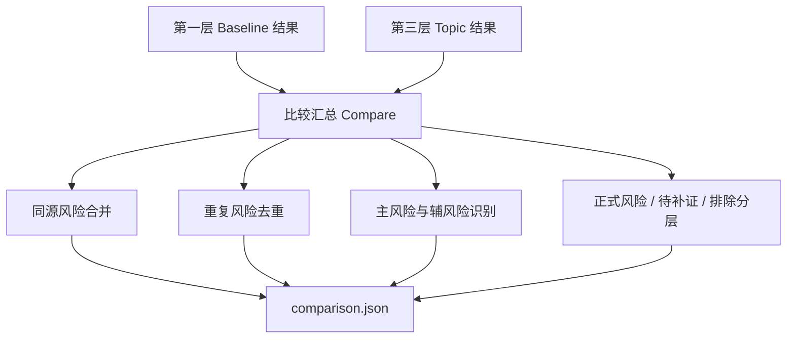

这一层直接决定：

- 哪些风险点最终展示给用户
- 哪些点只进入待补证
- 哪些点虽然命中过规则，但满足排除条件，不应当正式输出

### 5.5 第五层：统一输出

目标：

- 将内部结构化结果组装成统一、稳定、可展示的输出
- 让 Web、运营、研发使用同一份结果源

输入：

- 第一层结果
- 第二层结构结果
- 第三层专题结果
- 第四层比较汇总结果

输出产物：

- `review.md`
- `final_review.md`
- `final_output.json`
- `v2_overview.json`
- `topic_reviews/*.json`

架构图：

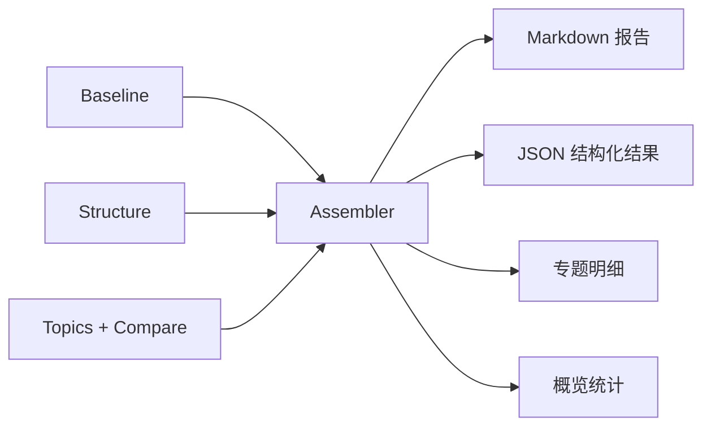

这一层的核心要求是：

- 标题统一
- 文案统一
- 风险编号统一
- 展示口径统一

---

## 6. 结果落盘产物图

这部分最适合运营和运维排障。

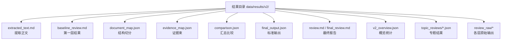

建议理解方式：

- `extracted_text.md` 看文本是否提取成功
- `document_map.json` 看结构是否切对
- `evidence_map.json` 看关键证据是否被送入专题
- `topic_reviews/*.json` 看专题是否识别出来
- `comparison.json` 看是否被错误去重或错误降级
- `final_output.json` 看标准输出是否完整
- `review.md` 看最终给用户展示的内容

---

## 7. 系统如何做到“尽量找全 + 尽量找准”

### 7.1 找全机制

系统不是依赖单一判断，而是通过以下方式提高召回：

1. 第一层全文直审先大范围抓取可疑点
2. 第二层按结构切分，避免关键片段被忽略
3. 第三层按专题交叉审查，减少单一视角漏报

这三步组合起来，解决的是“候选风险点尽量不要漏”。

### 7.2 找准机制

系统不是看到关键词就报，而是看完整触发条件是否成立。

每条规则要尽量维护以下要素：

1. 规则编号
2. 规则名称
3. 触发条件
4. 负样本 / 排除条件
5. 标准风险文案
6. 建议整改文案
7. 应落层级
8. 对应测试样本
9. 对应整改任务单

只有“触发条件成立”且“不满足排除条件”，才应该进入正式风险。

### 7.3 分层输出机制

系统不应把所有疑点都作为正式风险输出，而应分层：

- 正式风险：证据充分，可直接输出
- 待补证：有疑点，但证据不足
- 排除：命中候选表达，但满足排除条件

这样既能减少误报，又能保留有价值的复核线索。

---

## 8. 风险识别逻辑图

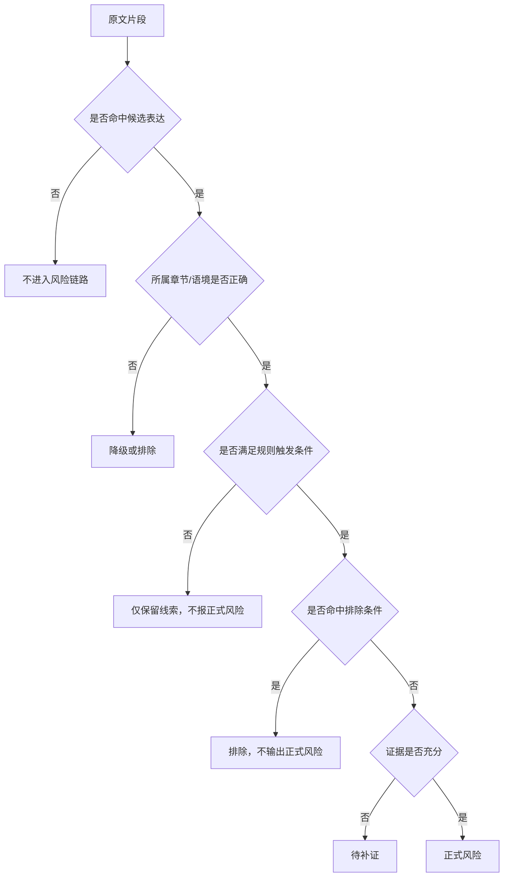

这张图体现的是：

- 先识别候选
- 再判断语境
- 再判断规则是否真正成立
- 再应用排除条件
- 最终再决定输出层级

---

## 9. 误报与漏报治理闭环

当客户、运营或 M 在复核时发现问题后，系统不应只做一次性人工解释，而应进入标准治理闭环。

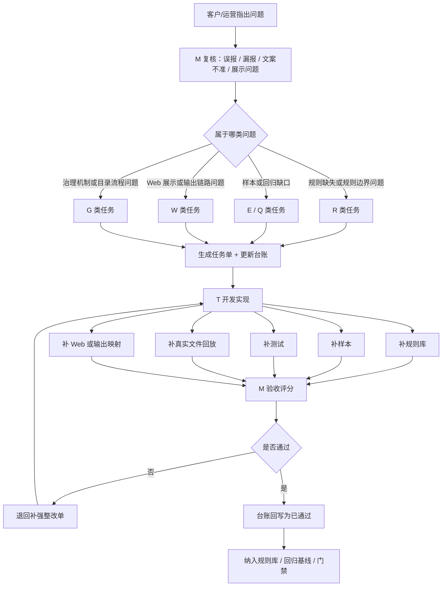

这个闭环的核心不是“修一次”，而是：

`把一次真实问题沉淀成长期规则能力。`

---

## 10. 角色职责矩阵

| 角色 | 核心职责 |
| --- | --- |
| 客户 / 业务 | 提供文件、提出漏报误报、提出新规则与优先级 |
| M | 分析问题、定义标准风险口径、生成任务单与台账、验收评分、决定是否通过 |
| T | 实现规则、补样本、补测试、补 Web 与输出链路、回传实现结果 |

可概括为：

- 客户提问题
- M 管治理与验收
- T 管实现

---

## 11. 运营 / 运维排障路径

### 11.1 完全没识别出来

如果某个风险点完全没报出来，建议按以下顺序排查：

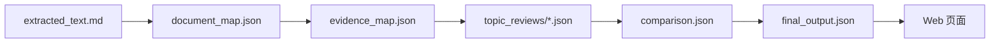

判断方式：

- `extracted_text.md` 没有原文：文件解析或提取问题
- `document_map.json` 没切到正确章节：结构层问题
- `evidence_map.json` 没把证据送进专题：第二层召回问题
- `topic_reviews/*.json` 有证据但没识别成风险：专题判断问题
- `comparison.json` 被错误去重、错误降级：汇总层问题
- `final_output.json` 有结果但页面没显示：展示映射问题

### 11.2 报出来了，但判断不对

如果已经输出了风险，但判断不准，应重点检查：

1. 是否满足完整触发条件
2. 是否存在负样本或排除条件未生效
3. 是否把模板占位符误判成正式风险
4. 是否把单项内部满分误判成总分风险
5. 是否将同一问题重复报成多条主风险

### 11.3 后端识别了，但 Web 没展示

应重点核查：

1. `final_output.json` 中是否已有该风险
2. Web 模板是否正确读取字段
3. 风险标题、类型、层级是否在前端映射中被过滤
4. 历史结果目录是否被正确加载

---

## 12. 适合领导汇报的层级关系图

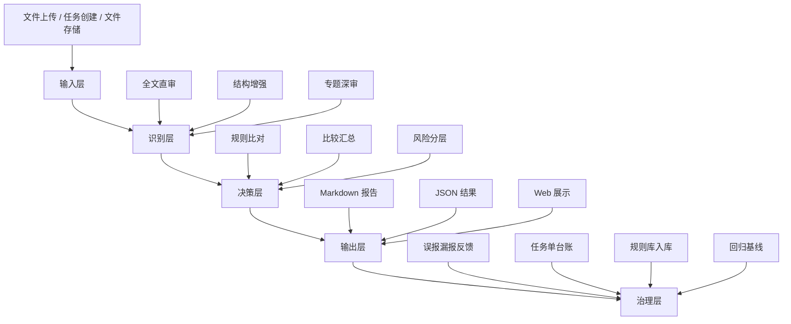

这张图可用于对外说明：

- 输入层负责把文件接进来
- 识别层负责尽量找全风险点
- 决策层负责尽量找准并分层
- 输出层负责把结果稳定地给用户看
- 治理层负责把一次问题变成长期能力

---

## 13. 当前架构的价值与边界

### 13.1 当前强项

1. 不是单层判断，而是多层交叉识别
2. 不只做审查，还做误报漏报治理闭环
3. 有真实文件回放，不只依赖样本
4. 有规则库、台账、任务单，便于持续演进
5. Web、规则、回归已有基本联动

### 13.2 当前重点关注点

1. 第二层证据召回是否稳定
2. 输出口径是否真正单源化
3. 排除条件是否沉淀充分
4. 真实文件基线覆盖是否足够

这些点决定了系统能否持续朝“精准找到风险点”的方向收敛。

---

## 14. 一句话总结

系统识别招标文件风险点的核心方法是：

`先用全文直审尽量找全候选风险，再用结构增强确定语境，再按专题规则深审，之后通过比较汇总完成去重、分层和标准化输出；对客户反馈的误报、漏报再进入治理台账、规则整改、真实文件回放和回归基线，形成持续变准的闭环。`

---

## 15. 相关文档

- [规则接入流程图](https://github.com/zeranlin/agent_bid_check/blob/main/docs/governance/rule-intake-workflow.md)
- [项目管理分层方案](https://github.com/zeranlin/agent_bid_check/blob/main/docs/governance/project-management-layering-plan.md)
- [规则接入 MVP Spec](https://github.com/zeranlin/agent_bid_check/blob/main/docs/governance/rule-intake-mvp-spec.md)
- [规则注册表维护机制](https://github.com/zeranlin/agent_bid_check/blob/main/docs/governance/rule-registry-maintenance-mechanism.md)
- [V2 规则与审查架构调整方案](https://github.com/zeranlin/agent_bid_check/blob/main/docs/governance/v2-rule-and-review-architecture-adjustment.md)
