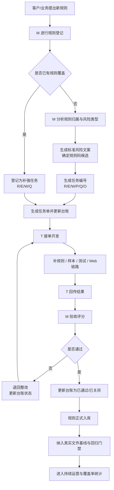

# 规则接入流程图

## 1. 目标

本流程用于统一管理“客户新增规则”进入项目后的完整生命周期，确保后续所有规则都按一致流程完成：

- 规则登记
- M 分析归类
- 任务编号与下发
- T 开发实现
- M 验收评分
- 规则入库
- 回归基线纳入

本流程适用于：

- 新增业务规则
- 真实文件漏检触发的新规则
- 已有规则的补强与展示链路修复

## 2. 流程总览

## 3. 分阶段说明

### 阶段 1：规则提出

输入来源：

- 客户直接提出新规则
- 客户指出真实文件漏检点
- M 在验收或复核中发现规则空缺
- 真实文件回归中出现新漏点

最低输入信息：

1. 规则原文
2. 命中文件原文
3. 为什么认为存在风险
4. 是否已有 Web / 历史结果链接

### 阶段 2：M 规则登记

M 负责先把规则变成“可管理对象”。

至少登记以下字段：

1. 规则名称
2. 规则原文
3. 风险场景原文
4. 归属专题
5. 问题类型
6. 风险等级
7. 当前状态

### 阶段 3：覆盖判断

M 需要先判断：

- 是否已有编号规则覆盖
- 是否只是已有规则的补强
- 是否属于展示层问题
- 是否属于样本 / 回归缺口

判断结果：

- 已有规则但实现不完整：走补强任务
- 没有规则覆盖：新建规则任务
- 规则已实现但展示不一致：走 Web / 展示任务
- 规则已实现但回归不完整：走样本 / 质量任务

### 阶段 4：规则设计

M 需要产出：

1. 标准风险标题
2. 问题定性
3. 审查类型
4. 风险判断口径
5. 整改建议口径
6. 规则码候选

这一步的目标是：把自然语言规则转成系统可实现的标准对象。

### 阶段 5：任务编号与下发

按治理类型生成编号：

- `R-xxx`：规则识别整改
- `E-xxx`：样本 / 评测整改
- `W-xxx`：Web / 展示 / 链路整改
- `P-xxx`：产品功能
- `Q-xxx`：质量治理
- `O-xxx`：运营 / 汇报

然后同步生成：

1. 任务单
2. 台账条目
3. 初始状态

### 阶段 6：T 开发实现

T 负责：

1. 规则实现
2. 结构化信号补齐
3. compare 规则码补齐
4. 样本补齐
5. 测试补齐
6. Web / 展示补齐

### 阶段 7：M 验收

M 验收时至少检查：

1. 是否命中真实场景
2. 是否存在误报
3. 是否生成标准规则码
4. 是否生成标准标题
5. Web 是否展示一致
6. 是否已纳入真实文件回归

验收结论分为：

- `已通过`
- `未通过`
- `已关闭`

### 阶段 8：规则入库与持续运营

通过后需要进入：

1. 规则库
2. 样本库
3. 真实文件基线
4. 回归门禁
5. 覆盖率统计

这一步的目标是防止“修完一次，下次又丢”。

## 4. 角色职责矩阵

| 角色 | 主要职责 |
| --- | --- |
| 客户 / 业务 | 提规则、提真实文件、提优先级 |
| M | 分析、归类、编号、生成任务单、验收、入库 |
| T | 实现规则、补样本、补测试、回传结果 |

## 5. 关键管理原则

1. 所有新规则必须先登记，再开发
2. 所有任务必须先编号，再下发
3. 所有通过项必须更新台账
4. 所有已通过规则必须进入规则库
5. 所有高价值真实文件都必须进入基线库

## 6. 推荐配套文档

建议配套使用以下文档：

- [project-management-layering-plan.md](https://github.com/zeranlin/agent_bid_check/blob/main/docs/governance/project-management-layering-plan.md)
- `任务单 / 验收单模板规范`
- 规则总目录
- 真实文件基线说明
