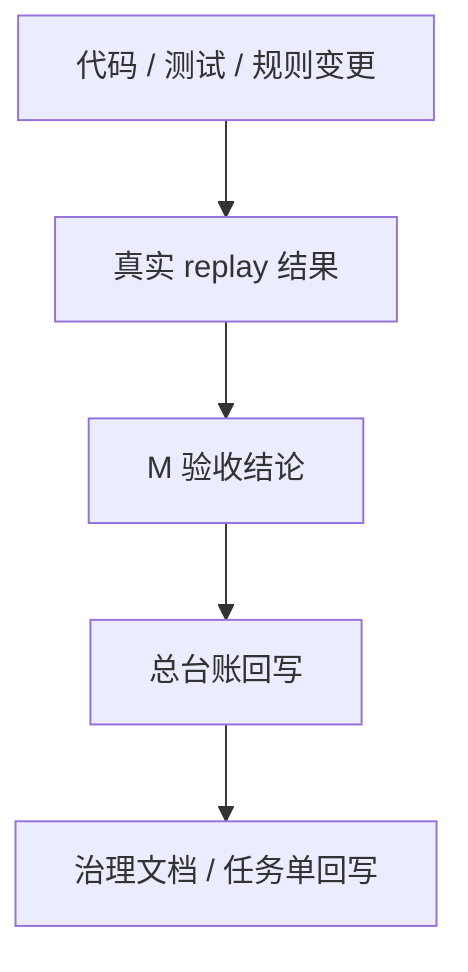

# 任务验收与文档同步机制

## 1. 目标

本机制用于解决以下长期问题：

1. 代码、测试、replay 已完成，但总台账仍停留在旧状态
2. 任务单已通过验收，但治理文档没有同步回写
3. 聊天记录里已经形成结论，但仓库内文档事实没有更新
4. M 与 T 对“任务是否真正完成”的理解不一致

一句话目标：

`把“技术完成”与“管理完成”彻底分开，并建立强制回写动作。`

## 2. 核心原则

后续所有任务统一遵守以下 4 条原则：

1. 没有台账回写，不算任务完成
2. 没有 replay 证据，不算正式验收通过
3. 架构/治理类任务没有同步治理文档，不允许关单
4. 任务状态必须以仓库文档事实为准，不能只以聊天结论为准

## 3. 三类事实源

项目内至少存在 3 类事实：

### 3.1 规则事实

主源：

- `rules/registry/`
- `rules/registry/governance-formal/`

用于说明：

- 哪些规则或治理型主源条目正在运行
- formal 主源从哪里来

### 3.2 运行事实

主源：

- `data/results/v2/<run_id>/`
- 关键 replay 基线目录

用于说明：

- 当前代码在真实文件上到底跑出了什么
- formal / pending / excluded 的最终结果是什么

### 3.3 管理事实

主源：

- `docs/trackers/v2-remediation-tracker.md`

辅助文档：

- `docs/tasks/*.md`
- `docs/governance/*.md`

用于说明：

- 当前任务状态
- 验收结论
- 治理阶段进展

## 4. 单向同步关系

后续统一按以下单向关系理解：

约束含义：

1. 代码不能直接定义任务完成
2. replay 不能自动等于关单
3. M 验收结论必须回写到台账
4. 架构类任务必须再同步治理文档

## 5. 任务完成的统一判定

一个任务只有同时满足以下条件，才允许标记为 `已通过` 或 `已关闭`：

1. 相关代码、配置、规则或文档修改已经完成
2. 相关测试已通过
3. 至少有一组可复核的 replay 或运行证据
4. M 已形成明确验收结论
5. 总台账已回写
6. 如属架构/治理/机制类任务，治理文档已同步

否则只能视为：

- 技术完成
- 待回写
- 待验收
- 或整改中

## 6. 固定验收流程

后续统一按以下流程执行：

### 第一步：T 回传

T 回传至少应包含：

1. 改了哪些文件
2. 跑了哪些测试
3. replay 目录或 run_id
4. 当前结果与任务目标的对照
5. 自评是否过线

### 第二步：M 验收

M 至少核 4 件事：

1. 功能是否达到任务目标
2. 测试是否真实通过
3. replay 是否支撑结论
4. 是否存在回退、误伤或文案失真

### 第三步：形成验收结论

M 必须明确给出：

1. 通过 / 未通过
2. 扣分项
3. 综合评分
4. 给 T 的验收回执文本

### 第四步：回写总台账

M 必须同步回写：

- `docs/trackers/v2-remediation-tracker.md`

回写前不得口头认定“已关单”。

### 第五步：同步治理文档

以下任务类型必须同步治理文档：

1. 架构调整任务
2. 治理机制任务
3. 主源收口任务
4. 分层准入任务
5. 影响长期处理流程的任务

## 7. 必须回写的文档范围

### 7.1 一定要回写

所有任务至少回写：

- `docs/trackers/v2-remediation-tracker.md`

### 7.2 条件性回写

符合以下任一情形时，还必须回写：

- 对应任务单
- 对应治理文档
- `docs/README.md` 入口说明

### 7.3 典型场景

#### 普通规则任务

至少回写：

1. 总台账
2. 对应任务单

#### 真实文件 replay 闭环任务

至少回写：

1. 总台账
2. 对应任务单
3. 必要时补 replay 说明文档

#### 架构治理任务

至少回写：

1. 总台账
2. 对应任务单或验收单
3. 对应治理文档
4. 必要时补 `docs/README.md`

## 8. 状态定义的执行口径

统一按以下口径使用状态：

- `待下发`
  - 任务已定义，但尚未正式交给 T
- `整改中`
  - T 已开始处理，但未提交可验收结果
- `待验收`
  - T 已回传结果，等待 M 复核
- `已通过`
  - M 已完成验收并确认过线，且文档事实已回写
- `未通过`
  - M 已验收，但未过线，需继续整改
- `已关闭`
  - 任务已通过，且确认不再继续跟踪

重点约束：

`没有文档回写，不允许使用“已通过”。`

## 9. M 的固定检查清单

每次验收后，M 固定检查以下问题：

1. 测试是否真实通过
2. replay 是否真实存在
3. 总台账是否已回写
4. 是否需要同步对应任务单
5. 是否需要同步治理文档
6. 是否需要补总入口 README

## 10. T 的固定交付要求

后续 T 的回传必须尽量带上以下内容：

1. 本次任务目标
2. 改动文件
3. 测试命令与结果
4. replay 路径或 run_id
5. 新旧结果差异
6. 是否需要 M 回写哪些文档

## 11. 例外处理

以下情况允许简化：

1. 纯文档任务
2. 纯台账回写任务
3. 纯入口 README 补充任务

但即使是简化任务，也要满足：

1. M 有明确结论
2. 总台账不冲突
3. 文档状态一致

## 12. 当前落地结论

本机制从本轮 `Q1 ~ Q7` 风险准入治理收口线后正式启用。

后续执行要求：

1. 不再接受“聊天里说通过，但仓库里没回写”的状态
2. 不再接受“代码是新的，台账还是旧的”的状态
3. 所有任务统一按“验收 -> 台账 -> 治理文档”顺序收口
