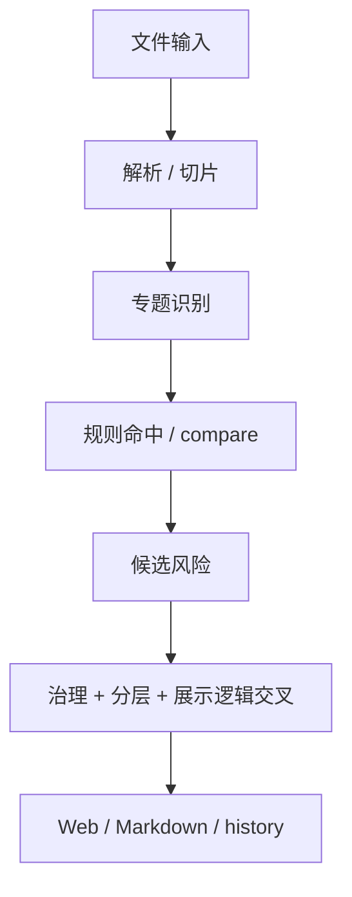
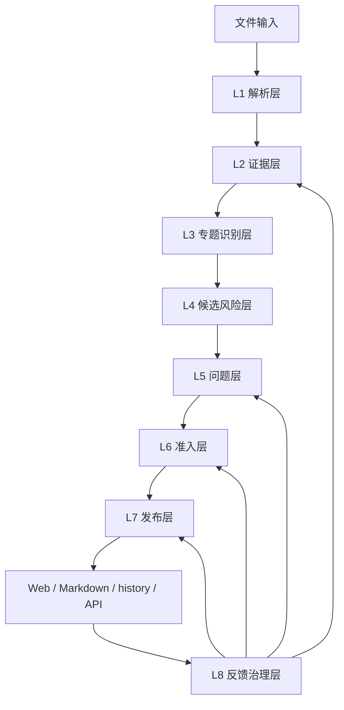

# V2 证据层 / 问题层 / 发布层重构方案

## 1. 背景

当前项目已经完成 `compare -> output_governance -> risk_admission` 的主链路收口，正式风险的分层方向已经基本正确。

但在真实文件持续回放中，系统仍反复暴露以下问题：

1. 模板条款、合同格式条款、留白项仍可能被误报
2. 同一问题会被拆成多条风险，或在 `formal / pending` 之间重复出现
3. 不同端展示结果虽然比过去稳定，但排查时仍然不够直接
4. 很多问题最终都被归因成“规则没写好”，但真实根因常常并不在规则层

这说明当前系统的主要矛盾，已经从“规则是否命中”转移为：

1. 文本是否先被建模为可信证据
2. 多个候选是否先被收敛为统一问题
3. 对外结果是否只消费统一终局快照

因此，本轮不建议启动 `V3`，而建议在 `V2` 上继续做一次结构化重构，重点补齐：

1. `证据层`
2. `问题层`
3. `发布层`

让系统从“文本命中引擎”升级为“问题治理引擎”。

## 2. 结论

从整体架构看，当前 `V2` 仍然成立，但必须继续做一轮三层重构：

1. `证据层前置并做厚`
2. `问题层独立并单源化`
3. `发布层改造成单源发布控制层`

本轮重构后，系统目标不再只是“识别到风险文本”，而是：

1. 稳定识别真正的硬风险
2. 稳定压制模板类、提醒类、留白类误报
3. 让同一问题只保留一个最终对象
4. 让 Web / Markdown / history / API 只消费统一终局快照
5. 让客户反馈能够被快速归因到具体层级

## 3. 当前老架构的主要问题

### 3.1 文本被过早当作“证据”

当前流程虽然已经有解析、专题、治理、准入，但很多地方仍然默认：

`抽到了原文片段 = 得到了可裁决证据`

这会导致：

1. 正文条款、模板条款、提醒项、合同格式条款混在一起
2. 技术、商务、资格、评分等业务类型识别分散在后续层级
3. 后续层即使做对了，也经常是在“错证据”上做对动作

### 3.2 同一个问题没有形成统一对象

当前系统已经有 `family_key`、`canonical_title`、吸收留痕，但在真实文件里仍会出现：

1. 同一问题被多个专题分别命中
2. 一个业务问题被拆成多条表现不同的风险
3. `formal / pending / excluded` 在问题级别还不够强单源

这说明当前系统更擅长“产生候选”，还不够擅长“统一问题”。

### 3.3 发布层还不是严格意义上的单源发布层

虽然当前最终输出已经明显收敛，但从可运维性、可回放性和可解释性看，发布层仍需要加强：

1. 对外对象仍需要更明确绑定 `run_id`
2. 问题对象、证据对象、展示对象之间的追溯链还不够直接
3. 客户反馈后，不能总是快速反推到“是哪条证据、哪个问题对象、为什么被放出来”

### 3.4 误报 / 漏报的根因归类仍然不够结构化

当前很多问题最终都被落成：

1. 新增规则
2. 补样本
3. 改 compare / governance / admission

但真实根因经常可能是：

1. 证据来源类型没判清
2. 业务域没判清
3. 问题归并不彻底
4. 发布快照不够标准化

如果不单独补这三层，后续继续加规则，误报/漏报仍会重复出现。

## 4. 重构目标

本轮重构的核心目标有 5 个：

1. 让文本先变成“可信证据对象”，再进入专题和规则
2. 让多个候选先收敛成“统一问题对象”，再进入分层
3. 让 `formal / pending / excluded` 只作用于问题对象，而不是直接作用于原始文本候选
4. 让所有对外结果只消费单一 `final snapshot`
5. 让客户反馈能够被稳定归因到证据层、问题层、准入层、发布层中的具体一层

## 5. 调整前后的总体架构

### 5.1 调整前

主要问题：

1. 证据建模偏弱
2. 问题对象不独立
3. 最终展示对象追溯链较弱

### 5.2 调整后

## 6. 各层职责

| 层级 | 名称 | 核心职责 | 明确不负责 |
| --- | --- | --- | --- |
| L1 | 解析层 | 文本抽取、结构切片、页码锚点、表格/章节映射 | 不做风险判断 |
| L2 | 证据层 | 将原文切片建模为结构化证据对象 | 不直接输出风险 |
| L3 | 专题识别层 | 按资格、评分、技术、商务、验收等专题识别候选信号 | 不做最终分层 |
| L4 | 候选风险层 | 汇总专题候选、基础匹配、形成候选家族 | 不直接对外发布 |
| L5 | 问题层 | 将多个候选收敛为统一问题对象并留痕 | 不直接对外展示 |
| L6 | 准入层 | 唯一决定 `formal / pending / excluded` | 不负责展示样式 |
| L7 | 发布层 | 统一生成最终发布快照并供各端消费 | 不再参与业务裁决 |
| L8 | 反馈治理层 | 承接客户反馈、任务单、台账、真实文件 replay | 不直接参与运行期分层 |

## 7. 证据层方案

### 7.1 设计原则

证据层是本轮最优先的重构层。

它要先解决一句话：

`这段原文到底是什么类型的证据`

而不是直接回答：

`这是不是风险`

### 7.2 证据对象模型

建议每条证据至少包含以下字段：

| 字段 | 含义 |
| --- | --- |
| `evidence_id` | 证据唯一标识 |
| `source_kind` | 来源类型 |
| `business_domain` | 业务域 |
| `clause_role` | 条款角色 |
| `evidence_strength` | 证据强弱 |
| `hard_evidence` | 是否足以支撑 formal |
| `excerpt` | 原文摘录 |
| `location` | 页码/章节/锚点 |
| `topic_hint` | 可能归属的专题 |
| `risk_signals` | 初步风险信号集合 |

### 7.3 来源分类

证据层至少要支持以下 `source_kind`：

| source_kind | 含义 |
| --- | --- |
| `body_clause` | 正文条款 |
| `template_clause` | 模板条款 |
| `placeholder_clause` | 留白项 |
| `contract_template` | 合同格式条款 |
| `attachment_clause` | 附件 / 声明 / 承诺 |
| `reminder_clause` | 提醒项 / 待核实项 |
| `form_clause` | 表单 / 格式项 |
| `sample_clause` | 样品相关条款 |

### 7.4 业务分类

证据层至少要支持以下 `business_domain`：

| business_domain | 含义 |
| --- | --- |
| `qualification` | 资格条件 |
| `scoring` | 评分规则 |
| `technical` | 技术参数 |
| `technical_standard` | 技术标准引用 |
| `commercial` | 商务条款 |
| `acceptance` | 验收条款 |
| `policy` | 政策条款 |
| `procedure` | 流程条款 |
| `sample` | 样品要求 |
| `performance_staff` | 业绩 / 人员 / 证书 |

### 7.5 条款角色

证据层至少要支持以下 `clause_role`：

| clause_role | 含义 |
| --- | --- |
| `gate` | 准入门槛 |
| `scoring_factor` | 评分因素 |
| `technical_requirement` | 技术要求 |
| `acceptance_basis` | 验收依据 |
| `commercial_obligation` | 商务义务 |
| `supporting_material` | 证明材料要求 |
| `reminder` | 提醒 / 待核实 |

### 7.6 证据层能直接处理的典型案例

| 案例 | 老架构常见问题 | 新证据层处理方式 |
| --- | --- | --- |
| 合同留白 | 被误报为付款/保证金风险 | 识别为 `placeholder_clause`，默认不进 formal |
| 模板条款 | 被误报为商务失衡 | 识别为 `contract_template` 或 `template_clause` |
| 提醒项 | 被误抬为正式风险 | 识别为 `reminder_clause`，默认降级 |
| 付款方式加分 | 只识别到付款，没识别到评分 | `business_domain=scoring` + `clause_role=scoring_factor` |
| 赠送电脑打印机 | 被当作一般售后承诺 | 识别为评分条款 + 与采购无关赠品信号 |
| 外标引用 | 仅看成技术标准文本 | 标记为 `technical_standard`，供后续做跨专题冲突校验 |

## 8. 问题层方案

### 8.1 设计原则

问题层的核心职责是：

`把多个候选收敛成一个问题`

系统只有在统一问题对象之后，才有资格谈 `formal / pending / excluded`。

### 8.2 问题对象模型

建议每个问题至少包含：

| 字段 | 含义 |
| --- | --- |
| `problem_id` | 问题唯一标识 |
| `family_key` | 问题家族 |
| `canonical_title` | 标准标题 |
| `source_evidence_ids` | 关联证据集合 |
| `candidate_ids` | 关联候选集合 |
| `rule_ids` | 关联规则集合 |
| `primary_problem` | 主问题摘要 |
| `secondary_notes` | 次级说明 |
| `governance_trace` | 归并、吸收、替换、排除留痕 |

### 8.3 问题层的核心动作

1. 同簇候选归并
2. 主副风险吸收
3. 跨专题重复压缩
4. 标题规范化
5. 一问题一归宿

### 8.4 问题层能直接处理的典型案例

| 案例 | 老架构常见问题 | 新问题层处理方式 |
| --- | --- | --- |
| 商务失衡 | 单方变更、单方解除、结算不明拆成多条 | 归并成同一商务问题对象 |
| 样品风险 | 样品要求、样品评分、样品验收多条漂移 | 归并到同一样品问题簇 |
| 技术标准异常 | 异常标准引用和地域检测机构限制混挂 | 按问题家族拆清并去重 |
| 资格与评分混杂 | 资格门槛和评分门槛各报一条但指向同一问题 | 在问题层统一问题边界 |
| pending / formal 并存 | 同一家族跨层同时存在 | 同一 `problem_id` 只保留一个最终归宿 |

## 9. 准入层在新架构中的位置

本轮不推翻 `risk_admission`，而是进一步明确：

1. 它只吃“问题对象”
2. 它仍然是唯一三分层出口
3. 它不再承接原始文本层的复杂分类职责

准入层至少要保证：

1. `hard_evidence=false` 的问题默认不得进入 `formal`
2. 模板、留白、提醒项默认不得进入 `formal`
3. 同一 `problem_id` 只能保留一个最终层级
4. 每个结果都要保留 `admission_reason`

## 10. 发布层方案

### 10.1 设计原则

发布层不是简单渲染层，而是“统一发布控制层”。

发布层的核心职责是：

1. 绑定唯一 `run_id`
2. 生成统一 `final snapshot`
3. 让所有端只消费这一份快照

### 10.2 发布对象

统一发布对象建议至少包含：

| 字段 | 含义 |
| --- | --- |
| `run_id` | 本次结果唯一标识 |
| `formal_problems` | 正式问题集合 |
| `pending_problems` | 待补证问题集合 |
| `excluded_problems` | 排除问题集合 |
| `trace_index` | 问题到证据、规则、原因的索引 |
| `publish_meta` | 发布时间、版本、摘要信息 |

### 10.3 发布层能直接处理的典型案例

| 案例 | 老架构常见问题 | 新发布层处理方式 |
| --- | --- | --- |
| Web 与 Markdown 不一致 | 两端可能吃到不同来源 | 只认 `final snapshot` |
| history 残留旧口径 | 历史页面未完全绑定最终结果 | history 也只认 `run_id + final snapshot` |
| 运维排查慢 | 很难反推具体来源 | 从发布对象直接回到 `problem_id / evidence_id` |
| 客户反馈复现难 | 无法快速定位是哪次结果 | 每次反馈直接关联到 `run_id` |

## 11. 典型场景前后对比

| 场景 | 老架构表现 | 新架构表现 | 卡点层级 |
| --- | --- | --- | --- |
| 模板留白 | 可能误报 | 证据层直接识别并拦截 | 证据层 |
| 赠品得分 | 可能漏报或归错类 | 证据层识别评分 + 与采购无关物资；问题层归并为正式问题 | 证据层 + 问题层 |
| 拒绝进口 vs 外标引用 | 容易漏掉跨专题矛盾 | 两类证据结构化后，由问题层做一致性冲突识别 | 证据层 + 问题层 |
| 付款周期加分 | 只看到付款，不一定看到评分违规 | 证据层先标 `scoring_factor` | 证据层 |
| 样品要求过细 | 可能拆成多条 | 问题层统一为样品门槛问题簇 | 问题层 |
| 商务失衡 | 报告上多条近义风险 | 问题层统一对象，发布层只放一个正式问题 | 问题层 + 发布层 |
| Web 结果和报告不一致 | 仍有展示漂移风险 | 发布层单源发布 | 发布层 |

## 12. 预期收益

本轮重构完成后，预期收益包括：

1. 模板类、提醒类、留白类误报明显下降
2. 同一问题的重复报明显下降
3. 正式风险的解释成本明显下降
4. 客户反馈可以被快速归类到具体层级
5. 运维定位问题的速度明显提升

## 13. 验收口径

本轮架构重构通过，至少满足以下条件：

1. 证据层已支持来源分类 + 业务分类 + 条款角色三类建模
2. 问题层已形成稳定 `problem_id`
3. 同一问题不再跨层并存
4. `risk_admission` 继续保持唯一三分层出口
5. 发布层已形成统一 `final snapshot`
6. Web / Markdown / history / API 只消费统一快照
7. 柴油、福建物业、福州一中等真实文件 replay 不回退

## 14. 实施建议

建议本轮重构按 4 条主线推进：

1. `A 线：证据层重构`
2. `B 线：问题层重构`
3. `C 线：发布层重构`
4. `D 线：回放与治理门禁补强`

具体任务拆解与先后顺序，见：

- [v2-evidence-problem-publish-refactor-roadmap.md](https://github.com/zeranlin/agent_bid_check/blob/main/docs/governance/v2-evidence-problem-publish-refactor-roadmap.md)

## 15. 最终结论

当前系统最大的问题，已经不是“规则数量不够”，而是：

1. 证据对象不够稳定
2. 问题对象不够单源
3. 发布对象不够统一

因此，本轮最有价值的工作不是继续盲目扩规则，而是先把：

1. `证据层`
2. `问题层`
3. `发布层`

三层彻底治理硬。
