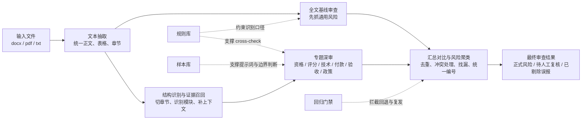
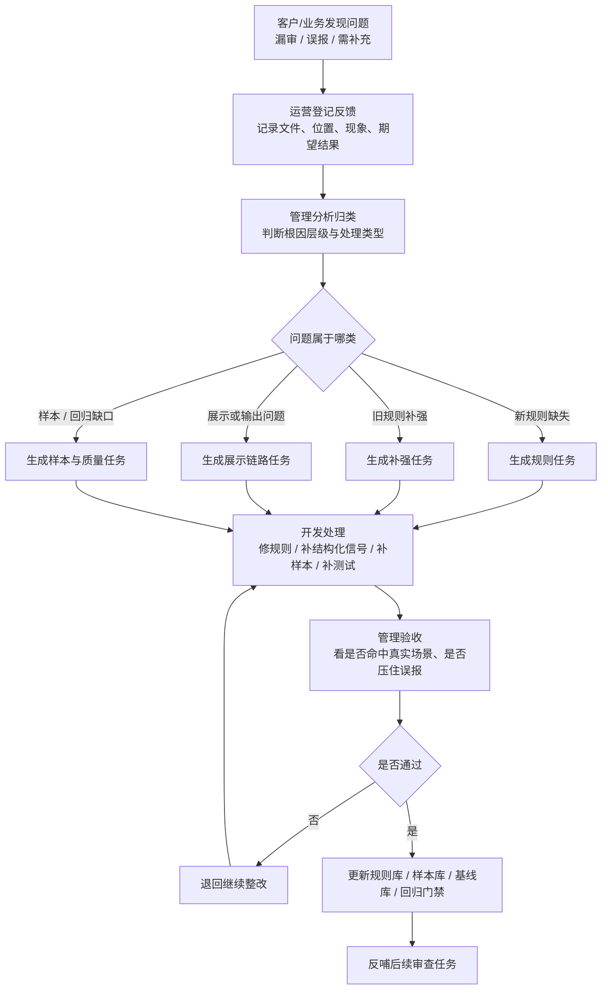

# 风险点有效识别与闭环治理图示设计

## 1. 背景

当前项目已经不是单次大模型直出结果的工具，而是逐步形成了：

- 分层审查链路
- 专题化风险识别
- 规则治理机制
- 客户反馈闭环
- 回归与持续运营机制

因此，“如何有效检查出风险点”不能只解释成模型如何判断，而应同时回答两件事：

1. 风险点在系统主链路中如何被发现
2. 当风险点漏掉、误判或需补充时，系统如何通过闭环持续变强

本设计文档用于输出两张图：

1. 风险识别分层图
2. 客户反馈纠偏闭环图

## 2. 设计目标

本次图示设计需要满足以下目标：

- 能向管理层解释为什么项目采用分层识别，而不是一次性输出
- 能向运营说明风险点可能在哪一层被识别，问题断点如何定位
- 能向管理、运营、开发说明客户反馈如何进入正式闭环
- 能体现“规则库、样本库、回归门禁”对长期准确性的作用
- 图本身适合在文档、汇报或流程说明中直接复用

## 3. 设计范围

本设计只覆盖“风险识别与纠偏闭环”的说明，不覆盖以下内容：

- 页面 UI 细节
- 具体代码实现
- 具体规则字段设计
- 具体测试命令和产物细节

## 4. 方案选择

本次最终采用“两张图组合”的方案，而不是单张全景图。

原因如下：

- 单张图容易把“主链路”和“反馈闭环”挤在一起，信息密度过高
- 两张图更适合分别回答“怎么发现风险”和“发现不准后怎么办”
- 该方式更适合项目当前阶段的对内说明与对外汇报

最终采用：

1. 图一：风险识别分层图
2. 图二：客户反馈纠偏闭环图

## 5. 图一设计：风险识别分层图

### 5.1 图一要回答的问题

图一主要回答以下问题：

- 一份文件进入系统后，风险点是如何逐层被发现的
- 为什么单层判断不够，需要分层识别
- 哪些风险更适合在全文基线层发现，哪些更适合在专题层发现
- 为什么最终输出前还需要汇总、对比和去重

### 5.2 图一核心模块

图一应包含以下模块：

1. 输入文件
2. 文本抽取
3. 全文基线审查
4. 结构识别与证据召回
5. 专题深审
6. 汇总对比与风险聚类
7. 最终审查结果
8. 规则库 / 样本库 / 回归门禁作为支撑能力

### 5.3 图一表达重点

- 文本抽取负责把文件转成可处理文本，是前置基础
- 全文基线审查负责先抓通用风险
- 结构识别与证据召回负责减少漏项
- 专题深审负责提升定向识别能力
- 汇总层负责解决重复、冲突和遗漏解释问题
- 规则库、样本库、回归门禁不是主链路节点，但对整体准确性持续生效

### 5.4 图一 Mermaid

## 6. 图二设计：客户反馈纠偏闭环图

### 6.1 图二要回答的问题

图二主要回答以下问题：

- 客户发现“审查不对”后，问题如何进入正式处理
- 谁负责登记、分析、开发、验收
- 为什么客户反馈不会只停留在聊天记录里
- 为什么同类问题应当越来越少

### 6.2 图二核心模块

图二应包含以下模块：

1. 客户/业务提出反馈
2. 运营登记反馈
3. 管理分析归类
4. 判断是新规则、旧规则补强、展示问题还是样本/回归缺口
5. 开发修规则 / 补样本 / 补测试 / 修展示链路
6. 管理验收
7. 规则正式入库
8. 样本库、真实文件基线、回归门禁更新
9. 反哺下一次风险识别

### 6.3 图二表达重点

- 反馈进入后必须先登记，而不是直接口头处理
- 管理负责判断问题归属和处理路径
- 开发不只修代码，还要补样本和测试
- 验收后必须进入规则库和回归门禁
- 闭环的价值在于“防止修一次、下次再丢”

### 6.4 图二 Mermaid

## 7. 两张图的配套说明口径

### 7.1 对管理层的说明口径

- 图一强调“为什么系统不是一次性输出，而是分层识别”
- 图二强调“为什么客户反馈能转成持续增量能力”
- 两张图一起说明项目价值在于长期演进，而不是一次性审查

### 7.2 对运营的说明口径

- 图一用于判断问题可能断在哪一层
- 图二用于解释客户问题进入后的处理路径和闭环责任

### 7.3 对开发的说明口径

- 图一明确当前风险识别链路位置
- 图二明确修复不只改代码，还要补样本、补测试、进回归

## 8. 推荐使用方式

建议在以下场景使用这两张图：

- 项目汇报 PPT
- 运营培训材料
- 新成员 onboarding
- 客户反馈机制说明
- 项目治理文档补充说明

推荐展示顺序：

1. 先展示图一，讲“风险怎么被发现”
2. 再展示图二，讲“风险发现不准后如何持续纠偏”
3. 最后补一句总括：
   - 准确性来自分层识别
   - 稳定性来自回归门禁
   - 持续变强来自反馈闭环

## 9. 自检结论

本设计已完成以下自检：

- 无占位符、无 TBD、无待补字段
- 图一与图二职责边界清晰，无明显冲突
- 范围聚焦在“风险识别与闭环治理”，未扩散到无关 UI 或实现细节
- 所有说明口径均与当前项目的分层架构、规则治理和反馈闭环方向一致

