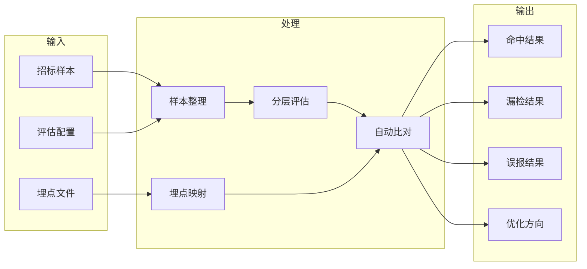

# V2 P0 第一批任务实施方案

## 1. 文档目标

本方案用于把 V2 backlog 中的 P0 任务进一步收敛成“第一批可直接实施”的任务包。

P0 目标不是把四层全部做完，而是优先回答下面这几个核心问题：

- 第一层到底漏了哪些风险
- 第二层到底漏了哪些证据
- 第三层哪些专题最容易漏判
- 埋点文件能不能转成稳定回归输入
- 系统每次改完后，能不能自动知道“命中了什么、漏了什么、多报了什么”

## 2. P0 范围

本批次只覆盖 backlog 中以下任务：

- Task 2：整理第一层专项样本集
- Task 3：补第一层评估脚本
- Task 10：第二层专项样本集建设
- Task 11：第二层评估脚本完善
- Task 16：建立专题专项样本集
- Task 17：补专题层评估脚本
- Task 24：定义埋点文件映射规则
- Task 27：实现自动比对脚本

不纳入本批次的内容：

- 页面展示增强
- compare 层专项样本与评估
- 埋点转换器的全面工程化
- 成本、时延、token 等工程治理项

## 3. P0 设计思路

P0 的本质不是“继续加能力”，而是先建立一套分层验证闭环。

如果没有这套闭环，后续对第二层、第三层、第四层的优化都会变成凭感觉调。

P0 应先形成以下能力：

1. 能为第一层、第二层、第三层分别准备固定样本
2. 能对三层输出做自动评估
3. 能用埋点文件构造近似金标准
4. 能输出漏点、误报和命中结果

## 4. P0 主流程

## 5. 第一批任务拆分

### 5.1 批次 A：先把样本和评估骨架建起来

本批次解决：

- 第一层、第二层、第三层“怎么测”

包含任务：

- Task 2
- Task 3
- Task 10
- Task 11
- Task 16
- Task 17

#### A1. 整理第一层专项样本集

目标：

- 给全文直审层建立固定评估集

样本建议至少包含：

- 明确命中样本
- 易漏样本
- 负样本
- 高风险样本

建议文件：

- `data/examples/v2_baseline_eval_samples.json`

建议字段：

- `sample_id`
- `document_name`
- `source_file`
- `case_type`
- `expected_risks`
- `must_hit`
- `must_not_hit`
- `notes`

验收标准：

- 能直接被 baseline 评估脚本读取

#### A2. 实现第一层评估脚本

目标：

- 能自动回答第一层：
  - 命中了什么
  - 漏了什么
  - 多报了什么

建议文件：

- `scripts/eval_v2_baseline.py`

输出建议：

- `baseline_eval.json`

指标至少包括：

- `risk_hit_rate`
- `miss_rate`
- `false_positive_rate`
- `high_risk_miss_rate`

验收标准：

- 对固定样本集可稳定输出 JSON 结果

#### A3. 建立第二层专项样本集

目标：

- 专门验证第二层召回完整性

样本至少覆盖：

- 资格条件识别准确性
- 评分办法识别准确性
- 合同/付款/验收识别准确性
- 混合章节漏召回情况

建议文件：

- `data/examples/v2_structure_eval_samples.json`

建议字段：

- `sample_id`
- `source_file`
- `focus_modules`
- `expected_sections`
- `coverage_expectations`
- `must_not_primary_modules`
- `notes`

验收标准：

- 能表达“必须召回哪些 section / 哪些专题不能漏”

#### A4. 实现第二层评估脚本

目标：

- 自动评估第二层召回是否够全

建议文件：

- `scripts/eval_v2_structure.py`

指标至少包括：

- `section_hit_rate`
- `primary_module_accuracy`
- `coverage_recall_rate`
- `mixed_section_secondary_recall_rate`

输出建议：

- `structure_eval.json`

验收标准：

- 能输出第二层漏召回的 section 明细

#### A5. 建立第三层专题样本集

目标：

- 专门验证专题判断质量

每个重点专题都应至少有四类样本：

- 明确命中样本
- 易混淆样本
- 负样本
- 需人工复核样本

第一批建议先覆盖专题：

- `qualification`
- `scoring`
- `technical_standard`
- `contract_payment`

建议文件：

- `data/examples/v2_topic_eval_samples.json`

建议字段：

- `sample_id`
- `topic`
- `case_type`
- `source_file`
- `input_scope`
- `expected_result`
- `notes`

验收标准：

- 能覆盖主要专题的四类基础样本

#### A6. 实现第三层评估脚本

目标：

- 自动评估专题层的命中、漏判、误报和人工复核表现

建议文件：

- `scripts/eval_v2_topics.py`

指标至少包括：

- `topic_hit_rate`
- `topic_miss_rate`
- `topic_false_positive_rate`
- `manual_review_expected_match_rate`

输出建议：

- `topics_eval.json`

验收标准：

- 能输出按专题拆分的评估结果

### 5.2 批次 B：把埋点文件接入回归链

本批次解决：

- 现有埋点文件怎么参与系统评估
- 如何从“固定样本评估”升级到“真实埋点回归”

包含任务：

- Task 24
- Task 27

#### B1. 定义埋点文件映射规则

目标：

- 把埋点文件从“人工反馈材料”变成“可用于回归的近似金标准”

建议产物：

- `docs/v2-annotation-mapping-spec.md`

映射应拆成两类：

1. 结构层映射
   - 哪些正文位置属于哪些模块
   - 哪些 section 应被某专题召回

2. 风险层映射
   - 风险标题
   - 风险等级
   - 审查类型
   - 原文位置
   - 是否需人工复核

验收标准：

- 同一份埋点文件可稳定生成结构金标和风险金标

#### B2. 实现自动比对脚本

目标：

- 将系统输出与埋点金标做自动对比

建议文件：

- `scripts/eval_v2_regression.py`

输入：

- 招标文件
- 埋点文件
- 系统运行结果

输出：

- `missed_risks.json`
- `false_positive_risks.json`
- `matched_risks.json`
- `regression_summary.json`

核心比对维度：

- 标题关键词
- 风险类型
- 风险等级
- 原文位置
- 是否人工复核

验收标准：

- 能明确输出：
  - 命中问题
  - 漏掉问题
  - 多报问题
  - 需复核但未复核问题

## 6. 实施顺序

### Step 1：先做批次 A

原因：

- 不先把样本和评估脚本建起来，后面所有优化都没有尺子

建议顺序：

1. `v2_baseline_eval_samples.json`
2. `eval_v2_baseline.py`
3. `v2_structure_eval_samples.json`
4. `eval_v2_structure.py`
5. `v2_topic_eval_samples.json`
6. `eval_v2_topics.py`

### Step 2：再做批次 B

原因：

- 有了固定样本的评估骨架后，再把埋点文件接进来，风险更低

建议顺序：

1. `v2-annotation-mapping-spec.md`
2. `eval_v2_regression.py`

## 7. 文件落位建议

### 7.1 样本文件

- `data/examples/v2_baseline_eval_samples.json`
- `data/examples/v2_structure_eval_samples.json`
- `data/examples/v2_topic_eval_samples.json`

### 7.2 脚本文件

- `scripts/eval_v2_baseline.py`
- `scripts/eval_v2_structure.py`
- `scripts/eval_v2_topics.py`
- `scripts/eval_v2_regression.py`

### 7.3 文档文件

- `docs/v2-annotation-mapping-spec.md`

### 7.4 测试文件

- `tests/test_v2_baseline_eval.py`
- `tests/test_v2_structure_eval.py`
- `tests/test_v2_topics_eval.py`
- `tests/test_v2_regression_eval.py`

## 8. 本批次完成后能回答的问题

P0 第一批任务完成后，系统至少应能回答：

1. 第一层容易漏哪些风险类型
2. 第二层在哪些场景下漏召回关键证据
3. 第三层哪些专题最容易误判或漏判
4. 当前版本相对埋点文件漏掉了哪些问题
5. 下一轮应该优先优化第二层、第三层还是第四层

## 9. 不在本批次解决的问题

以下内容明确后置：

- compare 层专项样本和评估
- 页面展示回归结果
- 成本与时延监控
- token 规模统计
- 配置快照与配置版本治理

这些问题重要，但不直接提升“先找全风险点”的主目标。

## 10. 一句话结论

P0 第一批任务的实质，不是新增更多模型调用，而是先建立一套：

- 第一层可测
- 第二层可测
- 第三层可测
- 埋点可比对

的分层验证体系。

只有这套体系建立起来，后面针对第二层召回、第三层专题 prompt、第四层 compare 的优化，才会真正朝“精准找到所有风险点”的方向收敛。
