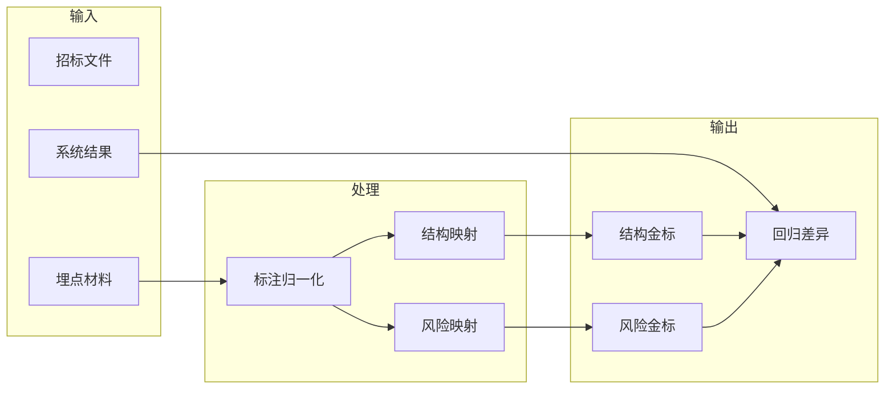

# V2 埋点映射规范

## 1. 目标

- 将“招标文件埋点/人工标注”转成 V2 可稳定消费的近似金标准。
- 同一份埋点材料，能够稳定映射为：
  - 结构层金标
  - 风险层金标
- 支持后续自动回归比对脚本直接输出：
  - `matched_risks.json`
  - `missed_risks.json`
  - `false_positive_risks.json`
  - `manual_review_gaps.json`
  - `regression_summary.json`

## 2. 适用范围

- 适用于来自批注文档、人工审查记录、埋点表格、复核意见的风险标注。
- 本规范不要求标注人直接按照程序内部结构写埋点。
- 程序侧先做一次“标注归一化”，再进入回归比对。

## 3. 基本原则

- 一个埋点只描述一个明确问题，不把多个问题揉成一条。
- 优先保留原文位置和原文摘录，减少仅靠标题语义匹配。
- 无法完全定性的事项，允许显式标记 `manual_review: true`。
- 结构层映射关注“证据有没有被召回到”，风险层映射关注“问题有没有被命中到”。
- 埋点是“近似金标准”，用于持续优化，不直接替代人工法律判断。

## 4. 映射总览



## 5. 结构层映射

### 5.1 目的

- 校验第二层是否召回了应被专题深审使用的关键章节。
- 校验模块识别是否偏离主模块。
- 校验混合章节是否被多个专题共享。

### 5.2 标准字段

结构层金标建议归一化为：

```json
{
  "required_sections": [
    {
      "id": "sec-contract-001",
      "title": "第五章 商务要求",
      "module": "contract",
      "secondary_modules": ["acceptance"],
      "source_location": "第五章 商务要求",
      "source_excerpt": "付款方式：验收合格后支付合同价款的95%",
      "required_for_topics": ["contract", "acceptance"],
      "notes": "商务与验收混合章节"
    }
  ],
  "topic_coverages": [
    {
      "topic": "contract",
      "required_titles": ["第五章 商务要求"],
      "required_modules": ["contract"],
      "min_sections": 1
    }
  ]
}
```

### 5.3 字段解释

- `required_sections`
  - 结构层的核心金标。
  - 表示该章节必须在 `document_map.json.sections` 中被稳定识别到。
- `title`
  - 以章节标题为主键。
  - 若无正式标题，可用“位置+短摘要”作为替代标题。
- `module`
  - 该章节的主模块归属。
  - 建议值使用现有结构层模块键：
    - `qualification`
    - `scoring`
    - `contract`
    - `acceptance`
    - `technical`
    - `procedure`
    - `policy`
- `secondary_modules`
  - 混合章节的次模块归属。
  - 用于监督共享召回能力。
- `required_for_topics`
  - 哪些专题应使用该章节作为证据来源。
- `topic_coverages`
  - 直接用于校验 `evidence_map.json.topic_evidence_bundles` 的召回结果。

### 5.4 判定规则

- 结构命中：
  - 系统识别出的 section 标题与金标 `title` 精确匹配，或包含关系稳定成立。
- 主模块命中：
  - `document_map.json.sections[].module` 与金标 `module` 一致。
- 次模块命中：
  - `document_map.json.sections[].module_scores` 或 evidence 召回结果中，包含金标 `secondary_modules`。
- 专题覆盖命中：
  - `evidence_map.json.topic_evidence_bundles[topic]` 中召回到了金标要求的标题与模块。

## 6. 风险层映射

### 6.1 目的

- 校验第三层和第四层是否命中真实风险点。
- 校验系统是否漏报、误报或未正确标记人工复核。

### 6.2 标准字段

风险层金标建议归一化为：

```json
{
  "risks": [
    {
      "id": "risk-contract-001",
      "title": "付款节点与财政资金到位挂钩",
      "aliases": ["付款以财政资金到位为前提"],
      "review_type": "商务条款失衡",
      "severity": "高风险",
      "source_location": "第五章 商务要求 付款方式",
      "source_excerpt": "采购人收到财政资金后15个工作日内支付合同款",
      "manual_review": false,
      "topics": ["contract"],
      "keywords": ["财政资金到位", "付款方式"],
      "notes": "明确风险"
    }
  ]
}
```

### 6.3 字段解释

- `id`
  - 金标唯一标识，便于回归长期追踪。
- `title`
  - 风险主标题。
- `aliases`
  - 同义表达、批注中的非标准标题。
  - 供自动比对时做弱匹配。
- `review_type`
  - 采用最终报告里的审查类型口径。
- `severity`
  - 建议值：
    - `高风险`
    - `中风险`
    - `低风险`
    - `需人工复核`
- `source_location`
  - 优先保留章节、条款号、页码或行号。
- `manual_review`
  - 该风险是否应被标记为“需人工复核”。
- `topics`
  - 该风险通常应由哪个专题命中。
  - 可多值。

### 6.4 判定规则

- 风险命中：
  - 标题或别名与系统输出有稳定匹配。
  - 且审查类型、原文位置、严重级别至少有部分支撑。
- 漏报：
  - 金标存在，但系统最终未召回到对应风险。
- 误报：
  - 系统输出风险在金标中找不到稳定对应项。
- 人工复核差异：
  - 金标要求 `manual_review=true`，但系统未标记。
  - 或系统标记了人工复核，但金标为明确结论。

## 7. 推荐的归一化 JSON 契约

完整样例：

```json
{
  "sample_id": "annotation-case-001",
  "document_name": "示例招标文件.docx",
  "gold": {
    "structure": {
      "required_sections": [],
      "topic_coverages": []
    },
    "risks": []
  }
}
```

说明：

- `sample_id`
  - 回归样本唯一编号。
- `document_name`
  - 招标文件名或业务标识。
- `gold.structure`
  - 结构层金标。
- `gold.risks`
  - 风险层金标。

## 8. 从埋点材料到金标的映射建议

### 8.1 先抽结构证据

- 批注或人工意见中只要指出“这一段属于资格/评分/付款/验收”，就先映射为结构层。
- 不要求此时完成法律定性。

### 8.2 再抽风险点

- 同一位置若已有明确问题判断，再生成风险层条目。
- 若仅指出“这里可能有问题，但暂不确定”，保留：
  - `severity: "需人工复核"`
  - `manual_review: true`

### 8.3 一段对应多问题时

- 允许同一 `source_location` 下拆多条风险。
- 例如：
  - 标准已废止
  - 标准名称与编号不一致
  - 标准与采购标的无关
- 三者应拆成三条风险，避免后续误判“命中其中一项即算全部命中”。

## 9. 与当前 V2 产物的对应关系

结构层对应：

- `document_map.json`
- `evidence_map.json`

风险层对应：

- `comparison.json`
- `final_review.md`
- `topic_reviews/*.json`

推荐比对优先级：

1. `comparison.json`
2. `topic_reviews/*.json`
3. `final_review.md`

原因：

- `comparison.json` 已完成聚类与去重，最适合作为第四层输出。
- `topic_reviews/*.json` 可用于定位第三层专题命中情况。
- `final_review.md` 更适合展示，不适合作为唯一机器比对源。

## 10. 不纳入自动比对的情况

- 仅有模糊意见，无法定位原文位置。
- 多个问题合并成一句，无法拆解。
- 只写“需优化”“不太合理”，但没有明确问题对象。
- 明显依赖外部事实调查、招标背景材料或采购人补充说明。

此类情况建议：

- 保留人工复核标签
- 不强行做自动命中率统计

## 11. 最低验收标准

- 同一份埋点材料，重复归一化后输出稳定一致。
- 同一条风险不会因为标题表述不同而频繁漂移到不同金标项。
- 结构层与风险层能分别产出机器可比对 JSON。
- 自动回归脚本能输出：
  - 命中项
  - 漏报项
  - 误报项
  - 人工复核差异项
  - 结构召回差异项
