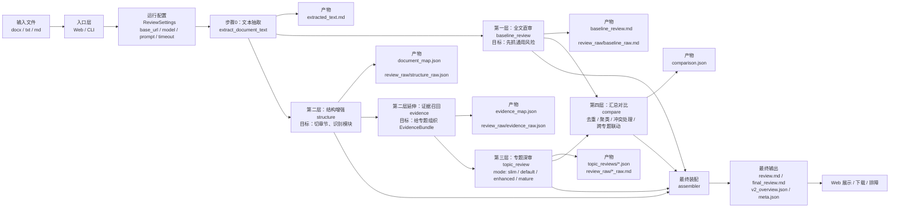
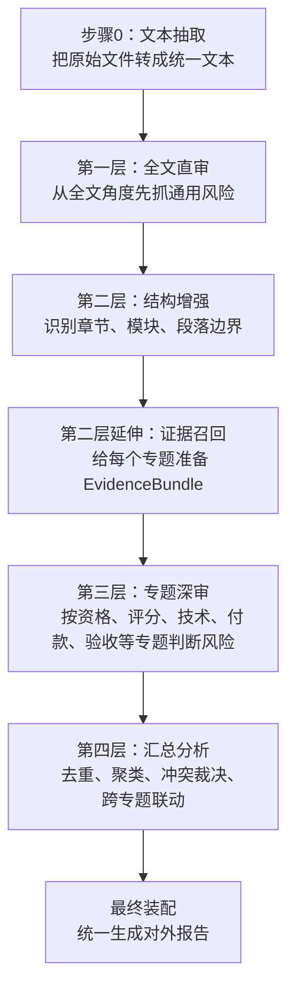
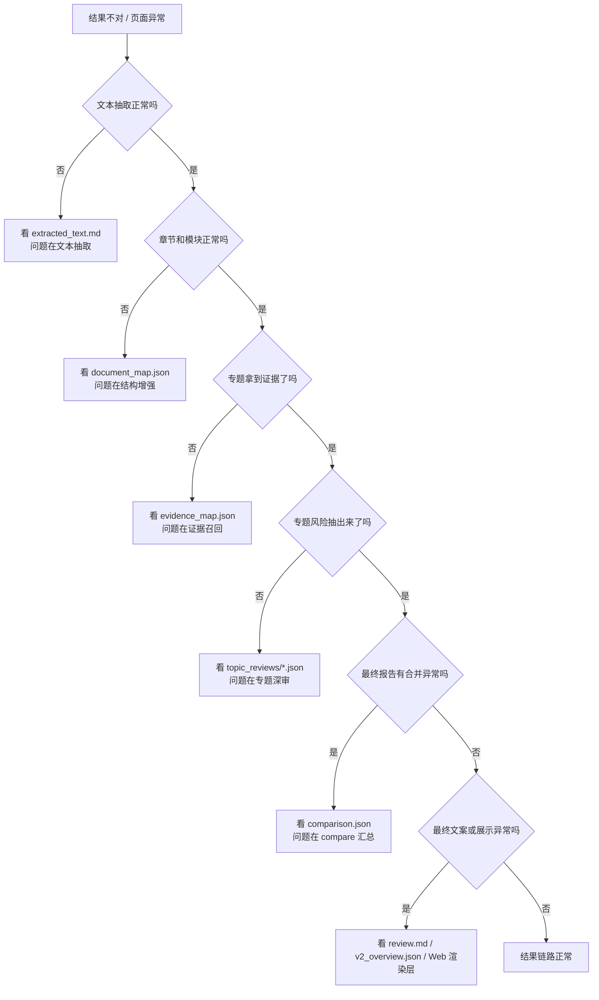

# V2 文件处理与审查架构汇报版

## 1. 文档目标

这份文档用于回答 4 个问题：

- 一份招标文件进入系统后，完整处理链路是什么
- 每一层分别负责什么、输入输出是什么
- 运行中间会落哪些产物，出问题时该先看哪个文件
- 面向领导汇报时，如何清楚说明这套架构为什么不是“单次大模型直出”

这份文档面向 3 类角色：

- 领导 / 技术负责人：看整体架构、分层价值、可解释性
- 运营人员：看结果链路、页面状态、常见问题定位
- 运维 / 排障人员：看目录、产物、步骤与故障断点


## 2. 一句话总览

当前 V2 不是“上传文件 -> 大模型一次性返回结果”，而是：

`输入接入 -> 文本抽取 -> 第一层全文直审 -> 第二层结构增强 -> 第二层证据召回 -> 第三层专题深审 -> 汇总去重与联动分析 -> 最终报告装配 -> Web 展示与结果落盘`

这套架构的核心价值不是只追求“能输出结果”，而是：

- 可解释
- 可追踪
- 可复核
- 可排障


## 3. 总体架构图




## 4. 分层职责图




## 5. 入口与运行方式

### 5.1 Web 入口

V2 Web 页面入口在：

- [v2_app.py](/Users/linzeran/code/2026-zn/test_getst/app/web/v2_app.py)

用户在页面点击“开始审查”后，系统执行：

1. 校验上传文件类型
2. 保存上传文件到 V2 上传目录
3. 生成 `job_id`
4. 启动后台线程
5. 调用 `review_document_v2(...)`
6. 审查完成后落盘结果目录
7. Web 页面根据 `job_id` 轮询状态并展示结果

关键路由：

- `/review-plus/start`
- `/review-plus/status/<job_id>`
- `/review-plus/history/<run_id>`


### 5.2 CLI 入口

V2 CLI 入口在：

- [run_review_v2.py](/Users/linzeran/code/2026-zn/test_getst/scripts/run_review_v2.py)

CLI 适合：

- 单文件调试
- 脚本化调用
- 批量回归前的手工验证


### 5.3 核心总控函数

真正的核心总控函数在：

- [service.py](/Users/linzeran/code/2026-zn/test_getst/app/pipelines/v2/service.py)

关键函数：

- `review_document_v2(...)`
- `save_review_artifacts_v2(...)`

这两个函数负责：

- 组织完整处理顺序
- 按顺序调用各层
- 汇总中间产物
- 最终落盘


## 6. 处理流程逐步拆解

### 6.1 步骤0：文本抽取

实现位置：

- [service.py](/Users/linzeran/code/2026-zn/test_getst/app/pipelines/v2/service.py)

调用函数：

- `extract_document_text(input_path)`

输入：

- 原始文件 `docx / txt / md`

输出：

- 统一文本字符串
- 落盘文件：`extracted_text.md`

作用：

- 把 Word、文本、Markdown 统一转换成后续链路可处理的文本
- 为后续三层审查提供共同输入

失败影响：

- 如果这一步失败，后面所有层都无法执行
- 这是最前置的硬阻塞步骤

运维排障优先看：

- `extracted_text.md`

典型问题：

- 表格内容抽取不完整
- 标题断裂
- 页眉页脚噪声混入正文
- 章节顺序错乱


### 6.2 第一层：全文直审

实现位置：

- [baseline.py](/Users/linzeran/code/2026-zn/test_getst/app/pipelines/v2/baseline.py)

核心逻辑：

- 调用旧版全文审查能力 `review_document(...)`
- 生成第一版全局风险报告

输入：

- 原始文件路径
- 运行配置 `ReviewSettings`

输出：

- 内存对象：`V2StageArtifact(name="baseline")`
- 落盘文件：
  - `baseline_review.md`
  - `review_raw/baseline_raw.md`

这一层主要负责：

- 从全文视角快速找明显风险
- 提供第一版通用风险基线
- 作为后续专题结果的对照基线

典型能抓的问题：

- 明显资格限制
- 评分办法不量化
- 技术参数明显指向性
- 商务条款明显失衡

这一层不能替代后续专题层的原因：

- 它看的是“整份文件的第一遍全局判断”
- 不擅长对某个专题做高密度、细颗粒度的深审

运维排障优先看：

- `baseline_review.md`
- `review_raw/baseline_raw.md`

如果这里没抓到明显问题，但专题层抓到了，不一定是 bug，更多说明：

- 专题层的证据聚焦更强
- 第三层发现了第一层漏掉的细节问题


### 6.3 第二层：结构增强

实现位置：

- [structure.py](/Users/linzeran/code/2026-zn/test_getst/app/pipelines/v2/structure.py)

输入：

- `extracted_text`
- `ReviewSettings`

输出：

- 内存对象：`V2StageArtifact(name="structure")`
- 落盘文件：
  - `document_map.json`
  - `review_raw/structure_raw.json`

这一层负责：

- 把文本切成章节候选
- 识别章节属于哪个模块
- 为下游专题提供可复用的结构地图

这一层的典型模块包括：

- `qualification`
- `scoring`
- `technical`
- `contract`
- `acceptance`
- `procedure`
- `policy`

这一层不是直接判风险，而是解决：

- 这段文字属于哪个业务模块
- 哪些章节需要被召回给后续专题

核心中间数据结构：

- `SectionCandidate`
- `ModuleHit`

定义位置：

- [schemas.py](/Users/linzeran/code/2026-zn/test_getst/app/pipelines/v2/schemas.py)

运维排障优先看：

- `document_map.json`

典型问题：

- 章节切分过碎
- 标题没识别到
- 模块归属错误
- 混合章节没有识别成共享证据

如果某个专题完全没报，且 `document_map.json` 里目标章节都没出现，问题大概率断在这一层。


### 6.4 第二层延伸：证据召回

实现位置：

- [evidence.py](/Users/linzeran/code/2026-zn/test_getst/app/pipelines/v2/evidence.py)

输入：

- `document_map.json` 对应的结构信息
- `topic_mode`
- 可选 `topic_keys`

输出：

- 内存对象：`V2StageArtifact(name="evidence")`
- 落盘文件：
  - `evidence_map.json`
  - `review_raw/evidence_raw.json`

这一层负责：

- 围绕每个专题，把相关章节组织成 `EvidenceBundle`
- 告诉第三层：
  - 哪些是主证据
  - 哪些是补充证据
  - 哪些模块缺失
  - 证据覆盖是否完整

核心数据结构：

- `EvidenceBundle`
- `TopicCoverage`

它和结构层的关系是：

- 结构层解决“文本怎么切、模块怎么认”
- 证据层解决“专题到底拿哪些内容去看”

运维排障优先看：

- `evidence_map.json`

典型问题：

- 章节识别出来了，但没有被挂到正确专题
- 主章节有了，配套章节没挂进去
- 共享章节只给了一个专题，另一个专题没拿到

如果 `document_map.json` 正常，但专题依然没报，先看这一层。


### 6.5 第三层：专题深审

实现位置：

- [topic_review.py](/Users/linzeran/code/2026-zn/test_getst/app/pipelines/v2/topic_review.py)

输入：

- `EvidenceBundle`
- `TopicCoverage`
- `ReviewSettings`
- `topic_mode`

输出：

- 内存对象：`list[TopicReviewArtifact]`
- 落盘目录：
  - `topic_reviews/*.json`
  - `review_raw/*_raw.md`

这一层负责：

- 按专题抽取风险点
- 给出专题摘要
- 标记是否需要人工复核
- 输出覆盖说明和失败原因

当前成熟专题典型包括：

- `qualification`
- `performance_staff`
- `scoring`
- `samples_demo`
- `technical_bias`
- `technical_standard`
- `contract_payment`
- `acceptance`
- `procedure`
- `policy`

这一层的关键价值：

- 它不是看全文，而是看“已经召回好的专题证据”
- 所以在细节型风险上更稳定

典型中间字段：

- `risk_points`
- `summary`
- `coverage_note`
- `need_manual_review`
- `failure_reasons`

运维排障优先看：

- `topic_reviews/<topic>.json`

典型问题：

- 证据已经有了，但风险没抽出来
- 风险抽出来了，但被错误降成“需人工复核”
- 多专题共享证据时，只命中了一个专题

如果结构层和证据层都正常，但风险没出来，问题大概率断在这一层。


### 6.6 第四层：汇总对比

实现位置：

- [compare.py](/Users/linzeran/code/2026-zn/test_getst/app/pipelines/v2/compare.py)

输入：

- 第一层基线结果
- 第三层专题结果

输出：

- 内存对象：`ComparisonArtifact`
- 落盘文件：
  - `comparison.json`

这一层负责：

- 第一层和第三层风险去重
- 相似风险聚类
- 冲突裁决
- 手工复核项整理
- 跨专题一致性规则

核心数据结构：

- `RiskSignature`
- `MergedRiskCluster`
- `ComparisonArtifact`

这一层的典型业务价值：

- 第一层和专题层都命中同一问题时，合并成一个主风险点
- 某个专题为“需人工复核”、另一个为“高风险”时，裁决最终显示级别
- 识别跨专题问题

当前已经在这一层承接的典型跨专题问题包括：

- 采购政策口径与技术标准口径不一致
- 例如“拒绝进口”与“外标直引”之间的联动判断

运维排障优先看：

- `comparison.json`

典型问题：

- 最终报告里风险重复
- 同一个问题被拆成多条
- 专题里明明报了，最终没进入主结果
- 跨专题风险没有被拼起来


### 6.7 最终装配层

实现位置：

- [assembler.py](/Users/linzeran/code/2026-zn/test_getst/app/pipelines/v2/assembler.py)

输入：

- 第一层基线结果
- 第二层结构信息
- 第三层专题结果
- 第四层汇总结果

输出：

- `review.md`
- `final_review.md`
- `v2_overview.json`

这一层负责：

- 生成统一对外报告
- 生成概览摘要
- 组织报告中的风险顺序、标题、说明文字

它不是“重新判断风险”，而是：

- 组装
- 编号
- 格式化
- 汇总摘要

运维排障优先看：

- `review.md`
- `v2_overview.json`

如果前面几层结果都正常，但页面最终显示不对，通常是这一层或 Web 读展示层的问题。


## 7. 运行产物全景图

单次 V2 运行目录通常包含以下产物：

```text
run_dir/
├── extracted_text.md
├── baseline_review.md
├── document_map.json
├── evidence_map.json
├── comparison.json
├── review.md
├── final_review.md
├── v2_overview.json
├── meta.json
├── topic_reviews/
│   ├── qualification.json
│   ├── scoring.json
│   ├── technical_standard.json
│   └── ...
└── review_raw/
    ├── baseline_raw.md
    ├── structure_raw.json
    ├── evidence_raw.json
    ├── qualification_raw.md
    ├── scoring_raw.md
    └── ...
```


## 8. 文件与目录位置

### 8.1 配置目录

- V2 配置文件：
  [review_v2.json](/Users/linzeran/code/2026-zn/test_getst/data/config/review_v2.json)

### 8.2 上传目录

- V2 上传文件目录：
  [data/uploads/v2](/Users/linzeran/code/2026-zn/test_getst/data/uploads/v2)

### 8.3 结果目录

- V2 结果目录：
  [data/results/v2](/Users/linzeran/code/2026-zn/test_getst/data/results/v2)

### 8.4 任务状态目录

- V2 Job 目录：
  [data/jobs/v2](/Users/linzeran/code/2026-zn/test_getst/data/jobs/v2)


## 9. 页面状态与内部步骤映射

Web 页面当前显示的步骤状态来自：

- [v2_app.py](/Users/linzeran/code/2026-zn/test_getst/app/web/v2_app.py)

当前阶段枚举：

- `file_reading`
- `baseline_review`
- `structure_analysis`
- `topic_review`
- `report_structuring`
- `completed`

它们和内部真实步骤的映射如下：

| 页面状态 | 内部步骤 | 说明 |
| --- | --- | --- |
| `file_reading` | 文本抽取 | 文件刚进入系统，正在转文本 |
| `baseline_review` | 第一层全文直审 | 先跑全文基线 |
| `structure_analysis` | 第二层结构增强 + 证据召回 | 页面上合并展示为一大步 |
| `topic_review` | 第三层专题深审 | 按专题逐个审 |
| `report_structuring` | compare + assembler | 汇总合并并生成最终报告 |
| `completed` | 全部完成 | 可进入结果页 |

这里要特别说明：

- 页面上的 `structure_analysis` 实际包含两部分：
  - 结构增强
  - 证据召回
- 页面上的 `report_structuring` 实际包含两部分：
  - compare 汇总
  - assembler 装配


## 10. 排障定位图




## 11. 常见问题与定位方式

### 11.1 页面显示“文件解析失败”

先看：

- `extracted_text.md`

如果这个文件为空或明显不完整，问题断在文本抽取。


### 11.2 某个明显章节没被识别

先看：

- `document_map.json`

如果目标章节根本不在结构图里，问题断在第二层结构增强。


### 11.3 章节识别到了，但专题没报风险

先看：

- `evidence_map.json`
- `topic_reviews/<topic>.json`

判断顺序：

1. 章节有没有被挂进对应专题
2. 专题有没有拿到足够证据
3. 专题有没有标 `need_manual_review`
4. 专题有没有 `failure_reasons`


### 11.4 专题里报了，最终报告没体现

先看：

- `comparison.json`

这通常是：

- 被去重合并掉了
- 被聚类到了另一条风险
- 被冲突裁决成其他级别


### 11.5 页面结果和目录里的文件不一致

先看：

- `meta.json`
- `job_id` 对应状态
- 结果页的 `run_id`

这通常是：

- 页面读到了旧 run
- 轮询状态与落盘结果不一致
- 历史结果读取偏移


## 12. 汇报时建议这样讲

如果面向领导或技术负责人汇报，建议用下面这套表达：

### 12.1 为什么不是单次大模型直出

因为政府采购审查不是“语言生成任务”，而是“文件解析 + 章节理解 + 证据召回 + 专题判断 + 汇总裁决”的组合任务。

如果只做单次直出，会有 3 个问题：

- 出错后不知道错在哪一层
- 同类问题无法稳定复用优化经验
- 运营和运维无法定位问题来源


### 12.2 为什么要做多层

因为不同层解决的是不同问题：

- 第一层解决“先把明显问题抓出来”
- 第二层解决“相关证据有没有找全”
- 第三层解决“专题细节有没有判断准”
- 第四层解决“多来源结果如何合并成统一结论”


### 12.3 为什么这套架构更适合业务长期演进

因为它支持：

- 局部优化
- 定向扩样
- 针对性回归
- 故障分层定位

也就是说，后续每补一个细节风险，不需要把整套系统推倒重来。


## 13. 细问时的标准回答

### 13.1 问：为什么第一层已经审了，还要第三层

答：
第一层是全文基线，第三层是专题深审。
第一层擅长抓通用明显风险，第三层擅长抓专题内的细节型、边界型、跨条款型风险。


### 13.2 问：第二层为什么不直接出风险

答：
第二层核心职责是“证据召回”，不是“风险裁决”。
如果第二层直接定风险，会把结构召回和业务判断混在一起，不利于定位漏报来源。


### 13.3 问：为什么还要 compare 汇总层

答：
因为第一层和第三层都可能命中同一问题。
没有 compare，最终结果会出现：

- 重复风险
- 严重级别冲突
- 跨专题问题无法统一解释


### 13.4 问：出了错怎么定位

答：
先按产物反推：

- 文本不对，看 `extracted_text.md`
- 章节不对，看 `document_map.json`
- 证据不对，看 `evidence_map.json`
- 专题不对，看 `topic_reviews/*.json`
- 汇总不对，看 `comparison.json`
- 最终文案不对，看 `review.md`


## 14. 当前架构的边界

这套架构已经能支撑：

- 上传文件后的完整三层审查
- 结构、专题、联动的分层排障
- Web 与 CLI 双入口
- 固定样本回归与门禁评估

但当前仍有两个现实边界需要在汇报时说明：

- 页面阶段展示是“合并展示”的，不是每个内部子步骤都单独可见
- 某些跨专题一致性问题仍在持续补强中，compare 层还在继续演进


## 15. 当前建议

如果这份文档用于对内培训和运维排障，建议后续继续配两类补充资料：

- 一份“按文件目录排障”的速查表
- 一份“常见故障案例 -> 对应产物 -> 处理动作”的手册

如果用于领导汇报，建议保留：

- 第 3 节总体架构图
- 第 4 节分层职责图
- 第 7 节运行产物全景图
- 第 12 节汇报话术

这样既能说明系统设计，又能经得起追问。
